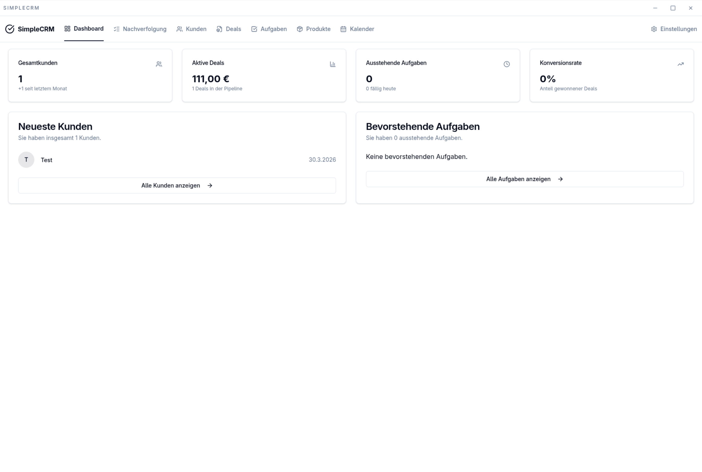

# SimpleCRM

SimpleCRM is a desktop-based Customer Relationship Management (CRM) application built with Electron, React, and TypeScript. It bundles essential CRM features on your local machine, helping you manage customers, products, deals, tasks, and your schedule. It also offers optional one-way data synchronization from your JTL MSSQL database. A self-hostable **server edition** (Fastify API + PostgreSQL, deployed with Docker) is also available — see [Server edition (Docker)](#server-edition-docker) below.

<p align="center">
  
</p>

## Features

* **Customer Management:** Create, Read, Update, and Delete customer records.
* **Product Management:** Keep track of your local product inventory and details.
* **Deal Tracking:** Create, manage, and visualize your sales deals. Link products and monitor stages from lead to win.
* **Task Management:** Create and manage tasks linked directly to customers.
* **Calendar Integration:** Schedule appointments, meetings, and reminders within the app.
* **JTL Synchronization (Optional):** Sync Customer and Product data from an external JTL MSSQL database into your local CRM (one-way sync).
* **E-Mail (IMAP + POP3 + SMTP, Desktop):** Accounts support **IMAP** or **POP3** (`node-pop3`); passwords in keychain. **E-Mail → SMTP & KI** configures outgoing mail (`nodemailer`), optional separate SMTP password, **Sent-Ordner** for IMAP-Append, **Google** and **Microsoft OAuth** (refresh tokens in keychain; IMAP XOAUTH2), and an **OpenAI-compatible** API for composer transforms. IMAP: first sync loads the newest messages only (capped); incremental UID search; optional server **thread id** when supported; background **IDLE** + periodic sync. POP3: UIDL-based incremental fetch.
* **CRM-style mail:** **JWZ-style threading** from Message-ID / References, **ticket codes** `[SCR-…]`, **customer** link, **internal notes**, **categories**, **assignment** to team members, **attachments** stored under userData (≤25 MB/file) with **open / save as**, **soft delete** / restore, **archive**, views **Inbox / Sent / Drafts / Archive**, **search**.
* **Workflows:** **E-Mail → Workflows** — **React Flow** visual editor (compiles to JSON), triggers **inbound**, **outbound**, **draft_created**, **schedule** (cron + optional **account sync** per workflow); actions include **forward_copy**, **tag_attachment_meta**, category, tags, etc. Cron jobs reload when workflows are saved.
* **Templates & KI:** Canned responses and custom AI prompts under **SMTP & KI**; **HTML composer** (React Quill) with plain-text fallback for SMTP.
* **Reporting & DSGVO:** **Mail-Report** (`/email/reporting`) with volume/unread/archived/workflow-run stats; **ZIP data export** (metadata + attachment files, no passwords) under **SMTP & KI**.
* **Plan vs. Stand:** siehe [`docs/EMAIL_PHASES.md`](docs/EMAIL_PHASES.md).
* **Dokumentation E-Mail:** [Entwickler/LLM](docs/DEVELOPER_EMAIL.md) · [Anwender](docs/USER_GUIDE_EMAIL.md) · [Learnings](docs/LEARNINGS_EMAIL.md) · [Deep Review](docs/email-system-deep-review.md) · [Changelog](CHANGELOG.md)
* **Not implemented (optional / later):** Omni-channel, SLA automation/escalation, full React Flow branching per edge, raw-mail full archive in export.
* **Local Database:** All your CRM data is stored securely and locally using SQLite (`better-sqlite3`).
* **Secure Configuration:** MSSQL connection details are stored securely using your OS keychain via Keytar (`keytar`).

## How it Works

SimpleCRM leverages the Electron framework to deliver a web-powered experience on your desktop:

1. **Main Process (`electron/main.ts`):** Handles window management, background logic, database interactions (SQLite & MSSQL), and inter-process communication (IPC). Manages essential services including `sqlite-service`, `mssql-keytar-service`, and `sync-service`.
2. **Renderer Process (`src/`):** The user interface built with React and Vite. Communicates with the Main process using secure IPC calls (defined in `electron/preload.ts`) to fetch and update data.
3. **Database (`electron/sqlite-service.ts`, `electron/database-schema.ts`):** Manages the SQLite database (`database.sqlite` in your app data folder), defining the schema and handling all data operations (Create, Read, Update, Delete).
4. **MSSQL & Sync (`electron/mssql-keytar-service.ts`, `electron/sync-service.ts`):** Connects securely to your JTL MSSQL database, fetches customer and product data, and updates your local SQLite database.
5. **UI Components (`src/components/`):** Built with Shadcn/ui library for a consistent and customizable user interface.

## Tech Stack

* **Framework:** Electron, React
* **Language:** TypeScript
* **UI:** Shadcn/ui, Tailwind CSS
* **Routing:** TanStack Router
* **Local Database:** SQLite (via `better-sqlite3`)
* **External DB Connection:** `mssql` package
* **Secure Storage:** `keytar`
* **Build Tool:** Vite
* **Bundler/Packager:** Electron Builder

## Setup & Installation

1. **Clone the Repository:**
   ```bash
   git clone <your-repository-url>
   cd simplecrmelectron
   ```
2. **Install Dependencies:**
   ```bash
   corepack enable
   corepack prepare pnpm@11.12.0 --activate
   pnpm install
   ```
   The root workspace is pinned to **Node.js 24 LTS**, **pnpm 11.12.0**, and
   **TypeScript 7.0.2+**. pnpm resolves the root peer-dependency tree without
   `--legacy-peer-deps`.
3. **Prepare Native Modules:**
   Node 24 and Electron 43 use different native ABIs. The `postinstall` script caches both `better-sqlite3` builds and leaves the workspace ready for Node-based tests. Electron commands select their cached ABI automatically and restore Node afterwards. If you encounter an ABI error, run:
   ```bash
   pnpm run native:initialize
   pnpm run native:status
   ```
   Do not run `electron-rebuild` directly; that replaces the single active binary without preserving the other runtime.

> **Windows users:** For a detailed step-by-step guide using PowerShell (including prerequisites like Visual Studio Build Tools, troubleshooting native module errors, and more), see **[docs/SETUP_WINDOWS.md](docs/SETUP_WINDOWS.md)**.

## Running the Application

* **Development Mode:**
  Starts the Vite dev server for instant UI updates and the Electron app.
  The `electron:dev` script compiles main-process TypeScript in watch mode so IPC handlers (including E-Mail) stay in sync with `dist-electron`.
  ```bash
  pnpm run electron:dev
  ```
  While this command is running, you should not need to manually rebuild after code changes.
* **Production Mode:**
  Runs the app as it would be packaged. Build the renderer with `pnpm run build:web`, compile the Electron main-process TypeScript with `pnpm run build:electron:main`, or run `pnpm run build` to do both.
  ```bash
  pnpm run electron:start
  ```

## Building the Application

To create an installer (`.exe`, `.dmg`, etc.):

1. **Build the Frontend & Electron Code:**
   ```bash
   pnpm run build
   ```
   This runs `build:web` (renderer) and `build:electron:main` (compiled IPC/services under `dist-electron/electron/`). The Vite Electron bundle step is included in `pnpm run build` via `vite build`.
2. **Package with Electron Builder:**
   ```bash
   pnpm run electron:build
   ```
   The installer will be created in the `dist-build` directory.

## Server edition (Docker)

Beyond the desktop app, SimpleCRM has a self-hostable **server edition**: a Fastify HTTP API (`packages/server`) backed by PostgreSQL, fronted by Caddy for TLS, and deployed with Docker Compose from the `docker/` directory. It enables multi-user, browser-based access to the same CRM data model.

- **Setup:** [docs/SETUP_SERVER.md](docs/SETUP_SERVER.md) — Docker Compose stack (Caddy + PostgreSQL + API), environment/secrets, and first-run owner setup.
- **Migrate from the desktop/standalone app:** [docs/MIGRATION_STANDALONE_TO_SERVER.md](docs/MIGRATION_STANDALONE_TO_SERVER.md).
- **Implementation status:** [docs/SERVER_EDITION_IMPLEMENTATION.md](docs/SERVER_EDITION_IMPLEMENTATION.md).

CI validates the stack end-to-end in the `server-compose-smoke` job (`.github/workflows/ci.yml`): it builds the images, boots PostgreSQL + migrations + API + Caddy, then runs the backup, doctor, and restore-drill profiles.

## Configuration

* **MSSQL Connection:** Configure the connection to your JTL MSSQL database in the **Settings** page within the app. Your password is stored securely in your operating system's keychain.
