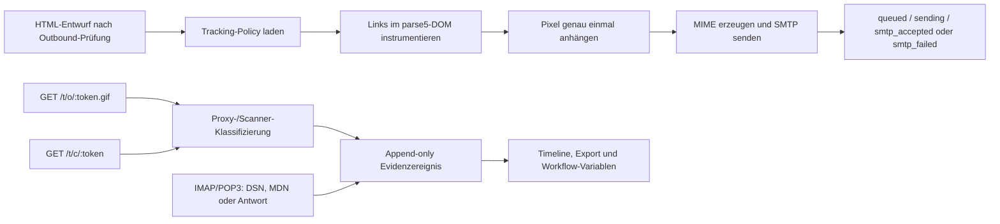

# E-Mail-Evidenz und Nachverfolgung (Server-Edition)

Stand: 2026-07-13

## Zweck und Grenzen

Die Server-Edition kann ausgehende HTML-E-Mails mit optionalen, datenschutzgesteuerten
Evidenzsignalen versehen. Die Anzeige trennt bewusst:

1. **Transport:** eingeplant, Versand gestartet, vom SMTP-Server angenommen, verzögert,
   fehlgeschlagen oder zurückgewiesen.
2. **Zustellung:** unbekannt, externes System erreicht oder durch DSN bestätigt.
3. **Interaktion:** kein Signal, automatischer Abruf, wahrscheinliches Öffnen,
   Linkinteraktion oder Antwort.

Die Signale sind keine Garantie, dass eine bestimmte Person die E-Mail gelesen hat.
Insbesondere gilt:

- SMTP-Annahme bestätigt nur die Annahme durch den konfigurierten SMTP-Server.
- Pixel können blockiert, gecacht oder von Datenschutz-Proxys und Scannern geladen werden.
- Links können vorab von Sicherheitssoftware aufgerufen werden.
- Bei mehreren Empfängern oder Weiterleitungen ist keine sichere Personenzuordnung möglich.
- Eine Antwort ist das stärkste Interaktionssignal, bestätigt aber nicht kryptographisch die
  Identität des Absenders.

## Aktivierung

Das Feature ist ausschließlich in der Server-Edition verfügbar und standardmäßig deaktiviert.
Voraussetzungen:

- `MASTER_KEY` mit 32 Byte Schlüsselmaterial.
- Korrekte `PUBLIC_BASE_URL`; produktiv ausschließlich HTTPS.
- Reverse-Proxy-Routing für `/t/*` zum API-Prozess.
- Vertrauenswürdige Proxy-Konfiguration (`TRUST_PROXY=1` im mitgelieferten Docker-Setup).
- Rechtsgrundlage, HTTPS-Datenschutzhinweis und aktive Admin-Bestätigung in
  **Einstellungen -> E-Mail -> Nachverfolgung**.

Jede materielle Änderung der Tracking-Konfiguration verlangt in UI und API eine neue Bestätigung. Das
Deaktivieren widerruft bestehende Tokens. Das Deaktivieren nur einer Signalart widerruft die
zugehörigen Pixel- beziehungsweise Klick-Tokens.

## Datenfluss

Die gespeicherte Entwurfsfassung wird nicht verändert. Nur das unmittelbar erzeugte MIME-HTML
wird instrumentiert. Reine Textmails sowie PGP-signierte oder PGP-verschlüsselte Nachrichten
werden nicht instrumentiert.

## Datenmodell

Migration `0027_email_evidence_tracking` führt ein:

- `email_tracking_policies`: Workspace-Policy, Rechtsgrundlage und Aufbewahrung.
- `email_tracking_messages`: unveränderlicher Policy-Snapshot pro Versand.
- `email_tracking_links`: verschlüsselte, nach Erstellung nicht mehr änderbare Linkziele.
- `email_tracking_events`: Ereignisse und optionale verschlüsselte Rohmetadaten.
- `email_tracking_token_resolver`: öffentlicher Hash-Resolver ohne Klartext-Token.

Alle fünf Tabellen erzwingen RLS. Der öffentliche Resolver enthält nur SHA-256-Token-Hashes,
IDs, Typ und Ablaufzeit. Anonyme Pixel- und Klickabrufe öffnen eine lokale Datenbanktransaktion,
deren zusätzliche RLS-Policy ausschließlich die Zeile des exakt vorgelegten Token-Hashes
sichtbar macht; ohne oder mit einem anderen Hash bleibt der Resolver vollständig unsichtbar.

## Token- und Metadatenschutz

- Öffentliche Tokens sind 256-Bit-HMAC-Werte in Base64url und werden nur als SHA-256-Hash
  nachgeschlagen.
- Linkziele sowie optionale IP-/User-Agent-Rohdaten sind mit AES-256-GCM verschlüsselt.
- Zweckgebundene Schlüssel werden per HMAC aus `MASTER_KEY` abgeleitet.
- Workspace, Tracking-ID, Link beziehungsweise Ereignis-Dedupe-Key sind AES-GCM-AAD.
- Caddy überspringt Access-Logs für `/t/*`; der Server redigiert diese Tokens zusätzlich vor
  Pino-Stdout und Diagnose-Log, da der Pfad ein bearer-artiges Token enthält.
- Öffentliche Endpunkte haben IP- und Token-Limits, 1,5 Sekunden Anwendungs-Timeout,
  persistente Minuten-Deduplizierung und maximal 10.000 öffentliche Ereignisse pro Nachricht.
- Ungültige Pixel-Tokens liefern dasselbe nicht cachebare GIF wie gültige Tokens.
- Klickziele werden nur als `http` oder `https` weitergeleitet; CR/LF und überlange Ziele
  werden verworfen.

## Metadaten und lokale IP-Intelligenz

Abgeleitete Metadaten sind optional: IP-Familie, Clientfamilie, Betriebssystemklasse,
Geräteklasse und Klassifizierungsgründe. Optional können die tatsächliche Client-IP und der
User-Agent verschlüsselt gespeichert werden. Nur Owner/Admins dürfen diese Rohdaten anzeigen
oder im Datenschutzexport entschlüsselt erhalten.

Optional kann der Server Country- und ASN-Daten aus lokal gemounteten MaxMind-GeoLite2-MMDBs
auswerten. Dabei verlässt keine Ereignis-IP den Server; es gibt keinen externen Lookup-Dienst und
keine Lookup-URL. Die Datenbanken werden nur über das optionale Docker-Profil `geoip` aktualisiert;
die API erhält ausschließlich einen schreibgeschützten Mount. Ohne Datenbanken sowie bei fehlenden,
veralteten oder beschädigten Dateien bleiben Versand und öffentliche Pixel-/Klick-Endpunkte aktiv;
IP-Insights und zusätzliche Proxy-Signale sind dann deaktiviert.

Country und ASN beschreiben allenfalls den ungefähren Standort der aufrufenden Infrastruktur oder
eines Proxys, nicht Wohnort, Gebäude oder sicheren Aufenthaltsort einer empfangenden Person.
MaxMind GeoLite2 ist unter der MaxMind-Lizenz zu verwenden und gemäß deren Anforderungen
zuzuschreiben: "This product includes GeoLite2 data created by MaxMind, available from
https://www.maxmind.com." Die Datenbankdateien sind Betriebsdaten, keine zusätzlichen
Ereignisdaten. Abgeleitete Country-/ASN-Ansichten bleiben nur Owner/Admins zugänglich und nur so lange, wie die nach der
Workspace-Policy erlaubten verschlüsselten Roh-IP-Daten noch aufbewahrt werden; es gibt keine
separate oder verlängerte Aufbewahrung für GeoIP-Ergebnisse.

Proton, Gmail und Apple können Remote-Inhalte über Proxy-Infrastruktur vorladen, cachen,
wiederverwenden oder blockieren. Deshalb können mehrere menschliche Öffnungen keinen neuen Abruf
erzeugen, ein Abruf kann automatisiert sein und ein fehlender Abruf ist kein Gegenbeweis. Das System
unternimmt keine Umgehung von Tracking-Schutz, Caches oder Blocklisten. Weder Pixel-/Linkabrufe
noch GeoIP-Daten beweisen, dass eine bestimmte Person die E-Mail gelesen hat oder persönliche
Kenntnis vom Inhalt hatte.

## Eingehende Evidenz

`detectInboundEmailEvidence` erkennt begrenzt geparste RFC-Felder:

- DSN `failed` / Status 5.x -> `bounced`.
- DSN `delayed` / Status 4.x -> `delayed`.
- DSN `delivered` / Status 2.x -> `dsn_delivered`.
- MDN `displayed` -> `mdn_displayed`.
- Nicht automatisierte Antwort mit `In-Reply-To`/`References` -> `replied`.

Standard-DSNs werden auch über den angehängten `message/rfc822`-Teil korreliert. Bei Antworten
werden bis zu 50 Thread-Referenzen geprüft und die jüngste passende ausgehende Tracking-Mail
verknüpft. Die eigene Message-ID des eingehenden Ereignisses wird nur gehasht zur Deduplizierung
verwendet. Empfängeradresse und freier SMTP-Diagnosetext werden nicht in Tracking-Metadaten
übernommen. Ein vom Absender mehr als fünf Minuten in die Zukunft gesetzter Zeitstempel wird auf
den serverseitigen Beobachtungszeitpunkt geklemmt.

DSN/MDN-Nachrichten werden nicht an Spam-Scoring, KI-Antwortvorschläge oder
Abwesenheitsantworten weitergegeben.

## Oberfläche und Rechte

- Gesendete Nachrichten zeigen im Metadatenbereich Transport, Zustellung und Interaktion.
- **Verlauf** öffnet die chronologische Evidenz mit Aussagekraft und Klassifizierungsgrund.
- Bei mehr als einem Empfänger erscheint eine Nicht-Zuordnungswarnung.
- Die Detailansicht zeigt die neuesten 1.000 Ereignisse; Summen berücksichtigen alle
  aufbewahrten Ereignisse.
- Owner/Admins können Rohdaten temporär entschlüsseln, Tokens widerrufen und alle
  Tracking-Daten einer Nachricht nach Bestätigung löschen.
- Der bestehende E-Mail-Datenschutzexport enthält Policy, Nachrichten, Links und Ereignisse.
  Rohdaten und Linkziele werden nur für Owner/Admins entschlüsselt exportiert. Tokens, Hashes,
  Ciphertexte und Dedupe-Keys werden nie exportiert.

## Workflows

Der Server-Knoten **Versandstatus lesen** (`email.read_tracking_evidence`) lädt nach einer
persistent überstandenen Wartezeit den aktuellen Stand. Variablen:

- `tracking.tracked`
- `tracking.transport`, `tracking.delivery`, `tracking.engagement`, `tracking.confidence`
- `tracking.open_count`, `tracking.click_count`
- `tracking.first_opened_at`, `tracking.last_opened_at`
- `tracking.first_clicked_at`, `tracking.last_clicked_at`
- `tracking.replied`, `tracking.replied_at`

Empfohlene praezise V2-Variablen fuer Pixelabrufe und wahrscheinlich menschliche
Oeffnungssignale:

- `tracking.pixel_fetch_count`
- `tracking.automated_pixel_fetch_count`
- `tracking.unknown_pixel_fetch_count`
- `tracking.probable_human_pixel_fetch_count`
- `tracking.probable_human_open_session_count`
- `tracking.first_pixel_fetched_at`, `tracking.last_pixel_fetched_at`
- `tracking.first_probable_human_open_at`, `tracking.last_probable_human_open_at`

Die Vorlage **Ausgehend: Ohne Reaktion nachfassen** versendet, wartet zwei Tage, lädt die
Evidenz neu und erstellt nur nach aktueller SMTP-Annahme bei aktivem Tracking ohne
wahrscheinlich menschliches Oeffnungssignal, menschlichen Klick oder Antwort eine Aufgabe.
Technische Proxy- und unklare Pixelabrufe unterdruecken den Nachfasspfad nicht. Eine MDN-Anzeige
ohne Pixelabruf startet dagegen keinen Nachfasspfad. Fehlgeschlagene, verzögerte oder gebouncte
Sendungen lösen diesen Nachfasspfad nicht aus. Schwellen und Wartezeit können im Workflow
angepasst werden.

## Aufbewahrung und Betrieb

Ein täglicher Ticker:

- löscht verschlüsselte Rohmetadaten nach 1 bis 30 Tagen,
- löscht Ereignisse nach 30 bis 3.650 Tagen,
- entfernt abgelaufene Resolver-Tokens,
- entfernt den Tracking-Container erst nach Tokenablauf und wenn keine Evidenz mehr existiert.

Fehler eines Workspace blockieren die Bereinigung anderer Workspaces nicht. Bei einem
Tracking-Fehler wird die Mail ohne Instrumentierung versendet und der Benutzer erhält eine
Warnung; der eigentliche Mailversand bleibt verfügbar.

## Wichtige Dateien und Tests

- Core: `packages/core/src/email/tracking.ts`
- Service: `packages/server/src/email-tracking.ts`
- API: `packages/server/src/api/email-tracking-routes.ts`
- Migration: `packages/server/src/migrations/0027_email_evidence_tracking.ts`
- UI: `src/components/email/message-evidence-panel.tsx`
- Einstellungen: `src/components/email/settings/tracking-settings-panel.tsx`
- Tests: `tests/unit/email-tracking*.test.ts`, `tests/unit/server-edition-foundation.test.ts`
