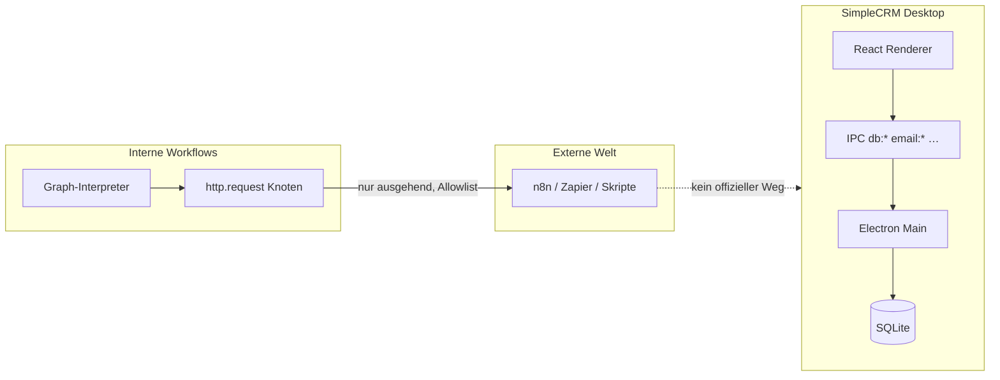
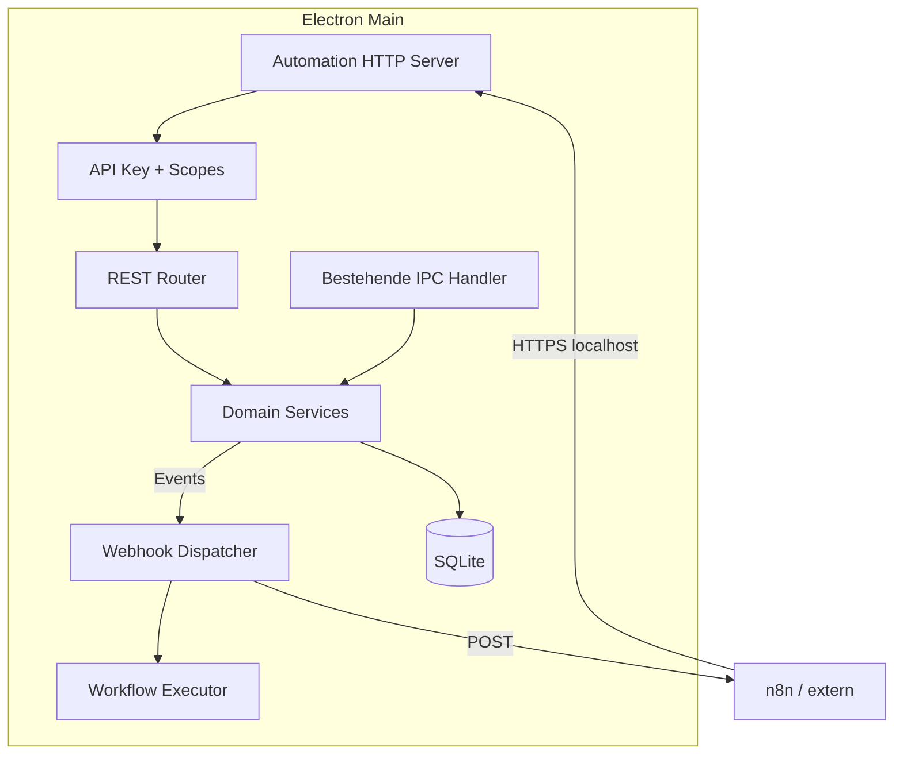

# Plan: Externe Automatisierung (n8n, Zapier, Make & Co.)

**Stand:** Mai 2026 · **Status:** Phase A & B **implementiert** (Branch `cursor/external-automation-api-d125`)

## Kurzantwort

| Frage | Antwort |
|--------|---------|
| Gibt es heute eine **öffentliche API** für n8n & Co.? | **Ja (lokal):** `http://127.0.0.1:3847/api/v1` — siehe [`API_V1.md`](API_V1.md) |
| Gibt es **PAI**? | Vermutlich gemeint: **API** — **REST + OpenAPI**; Inbound-Webhooks sind über `/api/v1/webhooks/incoming` angebunden |
| Was gibt es stattdessen? | **IPC** (nur Renderer ↔ Electron-Main), **interne Workflows** (React Flow), **ausgehend** `http.request` mit Host-Allowlist |
| n8n-Import/-Export? | **Nein** — eigenes Graph-Schema; in [`WORKFLOW_VISION.md`](WORKFLOW_VISION.md) nur „ggf. später Export-Subset“ |

SimpleCRM ist eine **lokale Desktop-App** (SQLite + Keytar). Externe Tools können die Daten **nicht unkompliziert ansteuern**, solange kein dedizierter **Automation-Layer** gebaut wird.

---

## 1. Ist-Zustand (technisch)

### 1.1 Architektur heute

| Mechanismus | Richtung | Für externe Tools nutzbar? |
|-------------|----------|----------------------------|
| `shared/ipc/channels.ts` (~100+ Kanäle: Kunden, Deals, Tasks, E-Mail, JTL, MSSQL, …) | UI → Main | **Nein** (nur im laufenden Electron-Prozess) |
| Interne Workflows (`electron/workflow/`) | Events in der App | **Teilweise** (`manual` / `webhook.incoming` über Automation-API; Mail/CRM/Cron bleiben App-Events) |
| `http.request` | SimpleCRM → URL | **Teilweise** (n8n kann **Webhooks empfangen**, SimpleCRM **ruft** n8n auf) |
| `webhook.incoming` | Lokale Automation-API/IPC → SimpleCRM | **Ja** (Secret erforderlich; startet Workflow-Trigger) |
| JTL/MSSQL-IPC | Main → Fremdsysteme | Nur **aus** Workflows/Kontext der App |

### 1.2 Was „fast“ extern geht (Workarounds)

1. **n8n als Ziel:** Workflow-Knoten **HTTP-Anfrage** → POST an n8n-Webhook-URL (Host in `workflow_http_allowlist`).
2. **n8n als Orchestrator:** n8n kann Workflows per API/Webhook anstoßen; vollständige CRM-/Mail-Steuerung läuft über die stabilen API-Endpunkte.
3. **Datenbank direkt:** SQLite-Datei unter `~/.config/simplecrm/` — **nicht empfohlen** (Schema-Migrationen, Mutex, Korruption, keine Geschäftslogik).
4. **Datei-/Sync-Integrationen:** Nur wo bereits vorhanden (z. B. MSSQL/JTL-Read in Workflows), nicht als generische API.

### 1.3 Abgrenzung zum internen Workflow-System

| | Intern (SimpleCRM Workflows) | Extern (n8n & Co.) |
|--|------------------------------|---------------------|
| Ziel | Mail/CRM im **gleichen Prozess** automatisieren | **Komplexe** Ketten, SaaS, Teams, Cloud-KI |
| Daten | Direkt SQLite | Braucht **stabile Schnittstelle** |
| Sicherheit | Fail-closed, Keytar, Allowlist | API-Keys, Netzwerk-Grenzen |

Beides soll **komplementär** sein: SimpleCRM = System of Record + Mail; n8n = Querschnitt-Orchestrierung.

---

## 2. Zielbild

> **Jedes relevante SimpleCRM-Element** (Kunden, Deals, Aufgaben, Kalender, E-Mail, Workflows, Sync) soll **optional** über eine **lokale, dokumentierte Automation-API** ansteuerbar sein — standardnah für n8n (HTTP Request / Webhook), Zapier, Make, curl und eigene Skripte.

### 2.1 Nicht-Ziele (v1)

- Kein **Cloud-Multi-Tenant-n8n**-Klon inside SimpleCRM.
- Keine **volle n8n-Workflow-Import-Kompatibilität** (eigenes Graph-Schema bleibt).
- Keine **offene Bindung** an `0.0.0.0` ohne Opt-in (Desktop-Sicherheit).
- Kein Ersatz für **DSGVO-Export** oder Bulk-Migration über die API (eigene Kanäle bleiben).

### 2.2 Designprinzipien

1. **Local-first:** Standard `127.0.0.1` + konfigurierbarer Port; optional LAN mit explizitem Opt-in.
2. **Fail-closed:** API standardmäßig **aus**; Aktivierung + API-Key im Keytar.
3. **OpenAPI-first:** Maschinenlesbare Spec → n8n OpenAPI-Node / Codegen.
4. **Service-Layer:** Geschäftslogik **nicht** duplizieren — IPC-Handler werden dünn, Services shared mit API.
5. **Ereignisse + Kommandos:** Webhooks **raus** (CRM-Events → n8n) und **rein** (n8n → Workflow/Action).
6. **Idempotenz & Audit:** `Idempotency-Key`, Request-Log in SQLite (Retention konfigurierbar).

---

## 3. Architektur-Vorschlag

### 3.1 Komponenten

| Komponente | Verantwortung |
|------------|----------------|
| `electron/automation/server.ts` | Minimaler HTTP-Server (z. B. `node:http` oder `fastify`) |
| `electron/automation/auth.ts` | Bearer-Token / `X-API-Key`, Scopes (`read:customers`, `write:deals`, …) |
| `electron/automation/routes/*.ts` | REST-Ressourcen |
| `electron/automation/webhooks.ts` | Outbound-Subscriptions + Inbound-Trigger |
| `electron/services/*` | Extrahierte Logik aus `ipc/*.ts` und `email/*` |

### 3.2 Bindung & Netzwerk

| Modus | Bindung | Use Case |
|-------|---------|----------|
| **Standard** | `127.0.0.1:3847` (Port konfigurierbar) | n8n auf gleichem Rechner |
| **LAN (Opt-in)** | `0.0.0.0` + Warnung + Firewall-Hinweis | n8n auf NAS/anderem PC |
| **Tunnel** | Dokumentation (ngrok/Cloudflare) — **nicht** eingebaut | Remote nur bewusst |

### 3.3 Sicherheit

- API-Key-Generierung in **Einstellungen → Automatisierung → Externe API** (neuer Tab).
- Scopes: mindestens `read`, `write`, `email`, `workflows`, `admin` (Sync/JTL).
- Rate-Limit (z. B. 60 req/min pro Key).
- Keine Passwörter/Keytar-Inhalte über die API.
- Optional: mTLS oder IP-Allowlist (Phase 2).

---

## 4. API-Oberfläche (Vorschlag v1)

Basis-Pfad: `/api/v1` · Format: JSON · Auth: `Authorization: Bearer <token>`

### 4.1 Ressourcen (Mapping aus bestehenden IPC-Kanälen)

| Domäne | Lesen | Schreiben | Anmerkung |
|--------|-------|-----------|------------|
| **Kunden** | `GET /customers`, `GET /customers/:id`, `GET /customers/search?q=` | `POST`, `PATCH`, `DELETE` | ≈ `db:*-customer` |
| **Deals** | `GET /deals`, `GET /deals/:id` | `POST`, `PATCH`, `DELETE`, `POST /deals/:id/stage` | ≈ `deals:*` |
| **Aufgaben** | `GET /tasks` | `POST`, `PATCH`, `DELETE`, `POST /tasks/:id/toggle` | ≈ `tasks:*` |
| **Kalender** | `GET /calendar/events` | `POST`, `PATCH`, `DELETE` | ≈ `db:calendar*` |
| **Produkte** | `GET /products` | CRUD | ≈ `products:*` |
| **E-Mail** | `GET /email/accounts`, `GET /email/messages`, `GET /email/messages/:id` | `POST /email/messages/:id/assign`, Tags, Archiv, … | Kein Roh-IMAP in v1 |
| **E-Mail senden** | — | `POST /email/compose/send` (stark validiert) | Fail-closed wie Outbound-Workflows |
| **Workflows** | `GET /workflows`, `GET /workflows/:id/runs` | `POST /workflows/:id/execute` (manual trigger) | Graph-JSON optional read-only |
| **Sync** | `GET /sync/status` | `POST /sync/run` | ≈ `sync:*` |
| **System** | `GET /health`, `GET /openapi.json` | — | Für Monitoring |

### 4.2 Ereignisse (Outbound → n8n)

`POST` an registrierte URLs (n8n Webhook-Knoten):

| Event | Auslöser in SimpleCRM |
|-------|------------------------|
| `customer.created` / `customer.updated` | Nach DB-Commit |
| `deal.stage_changed` | Bereits intern für Workflows — auch API-Event |
| `task.due` | Scheduler |
| `email.received` | Nach IMAP/POP3-Sync (neue Message) |
| `workflow.run.completed` / `workflow.run.failed` | Run-Steps |

Konfiguration: `POST /api/v1/webhooks/subscriptions` mit `{ url, events[], secret }`.

### 4.3 Eingang (Inbound ← n8n)

| Endpoint | Wirkung |
|----------|---------|
| `POST /api/v1/webhooks/incoming` | Startet Workflow mit Trigger `webhook.incoming`; Secret + Payload im JSON-Body |
| `POST /api/v1/workflows/:id/execute` | Manueller Lauf mit JSON-Kontext |

Implementierung koppelt an bestehenden `workflow-trigger-dispatch` / Graph-Interpreter.

### 4.4 n8n-Komfort

| Lieferstück | Beschreibung |
|-------------|--------------|
| **OpenAPI 3.1** | `GET /api/v1/openapi.json` |
| **Beispiel-Workflows** | Repo-Ordner `docs/n8n-examples/` (JSON-Export für n8n) |
| **Community-Node (optional, Phase 3)** | `@simplecrm/n8n-nodes-simplecrm` — später |

Kein Zwang zu Custom-Node: **HTTP Request** + **Webhook** reichen für v1.

---

## 5. Umsetzungsphasen

### Phase A — Fundament (MVP API) ✅

**Ziel:** n8n kann auf dem **gleichen Rechner** lesend/schreibend CRM bedienen.

- [x] Service-Layer: `CustomerService`, `DealService`, `TaskService` (additive Schicht; IPC unverändert)
- [x] HTTP-Server in Main, Default `127.0.0.1`, Feature-Flag `automation_api_enabled`
- [x] API-Key in Keytar, UI in Einstellungen → Automatisierung
- [x] Endpoints: `/health`, `/customers`, `/deals`, `/tasks` (CRUD + Search)
- [x] OpenAPI (`/openapi.json`) + [`API_V1.md`](API_V1.md)
- [x] Unit-/Integrationstests (`tests/unit/automation-api.test.ts`, IPC-Router)

**Erfolgskriterium:** n8n-Workflow „Neuer Shopify-Kunde → POST /customers“ ohne UI-Klick.

### Phase B — E-Mail & manuelle Workflows ✅

- [x] `GET /email/accounts`, `GET /email/messages` (Filter: account, view, since)
- [x] `POST /email/messages/:id/actions` (archive, tag, link-customer, assign, …)
- [x] `POST /workflows/:id/execute` mit Dry-Run-Default (`dryRun !== false`)
- [x] Scope `email` / `workflows`
- [x] Security-Review: [`SECURITY_AUTOMATION_API.md`](SECURITY_AUTOMATION_API.md)

**Erfolgskriterium:** n8n klassifiziert Mail extern (OpenAI-Node) und setzt Tag per API.

### Phase C — Webhooks & Events (bidirektional, teilweise umgesetzt)

- [ ] Outbound-Subscriptions + HMAC-Signatur (`X-SimpleCRM-Signature`)
- [x] Inbound `POST /api/v1/webhooks/incoming` → `webhook.incoming` Trigger
- [ ] Event-Emitter an DB-Hooks (customer, deal, email)

**Erfolgskriterium:** SimpleCRM feuert `deal.stage_changed` → n8n → Slack + Rückkanal API Update.

### Phase D — Erweiterung & Härtung

- [ ] Kalender, Produkte, Follow-up, Custom Fields
- [ ] LAN-Bindung Opt-in, Rate-Limits, Audit-Log-UI
- [ ] Optional: MCP-Server für Cursor/Claude Desktop (gleiche Services)
- [ ] Optional: CLI `simplecrm-cli` (curl-Ersatz für Skripte)
- [ ] Workflow-Export-Subset für n8n (nur Dokumentation, kein Import-Parser n8n→Graph)

---

## 6. Refactoring-Voraussetzungen

Damit die API **nicht** 100 IPC-Handler dupliziert:

1. **IPC-Handler** werden dünn: `registerIpcHandler` → `CustomerService.create(dto)`.
2. **Validierung** zentral (Zod-Schemas shared `shared/api-schemas.ts`).
3. **Fehlerformat** einheitlich: `{ error: { code, message, details } }`.
4. **Transaktionen** dort, wo heute SQLite direkt in Handlern liegt.

Betroffene Pakete (priorisiert): `electron/ipc/db*.ts`, `deals`, `tasks`, `email.ts`, `workflow.ts`.

---

## 7. Risiken & Mitigation

| Risiko | Mitigation |
|--------|------------|
| SQLite-Locks bei parallelen API + UI | Write-Queue oder `better-sqlite3` busy_timeout + kurze Transaktionen |
| Exfiltration über LAN | Default localhost, Opt-in + Warnung |
| E-Mail-Missbrauch (Spam-Versand) | Scope `email:send`, Rate-Limit, Outbound-Workflow-Check beibehalten |
| Wartungsdoppelung IPC + API | Service-Layer-Pflicht, keine Logik in Routen |
| n8n erwartet Cloud-SaaS | Doku: „Self-hosted Desktop“, Tunnel nur manuell |

---

## 8. Entscheidungspunkte (vor Start Phase A)

| # | Frage | Empfehlung |
|---|--------|------------|
| 1 | Port & Pfad fest? | Default `127.0.0.1:3847`, Pfad `/api/v1` |
| 2 | Nur HTTPS? | v1 HTTP localhost ok; TLS optional Phase D |
| 3 | Webhook-Inbound in v1? | Ja — `webhook.incoming`; Outbound-Subscriptions bleiben Phase C |
| 4 | MCP parallel? | Phase D, gleiche Services |
| 5 | Öffentliche API-Doku im Repo? | Ja, `docs/API_V1.md` + OpenAPI |

---

## 9. Bezug zu bestehender Doku

| Dokument | Relevanz |
|----------|----------|
| [`WORKFLOW_VISION.md`](WORKFLOW_VISION.md) | `webhook.incoming` ist umgesetzt; Outbound-Subscriptions bleiben Phase C |
| [`WORKFLOW_PHASES.md`](WORKFLOW_PHASES.md) | Interne P1–P7 bleiben; **W8 = External API** (neu) |
| [`DEVELOPER_EMAIL.md`](DEVELOPER_EMAIL.md) | E-Mail-IPC wird Service + API |
| [`AGENTS.md`](../AGENTS.md) | Kein Server-Prozess heute — Phase A ändert das bewusst |

---

## 10. Nächster Schritt

1. **Produktentscheid:** Phase A freigeben (Scope: Kunden/Deals/Tasks + Health + OpenAPI).
2. **Technisch:** Spike `electron/automation/server.ts` mit `GET /health` + Key-Check (1–2 Tage).
3. **Doku:** Nach Spike `docs/API_V1.md` aus OpenAPI generieren.

*Bis zur Umsetzung bleibt die einzige „Integration“ zu n8n: **ausgehende** `http.request`-Knoten in SimpleCRM-Workflows mit Allowlist.*
