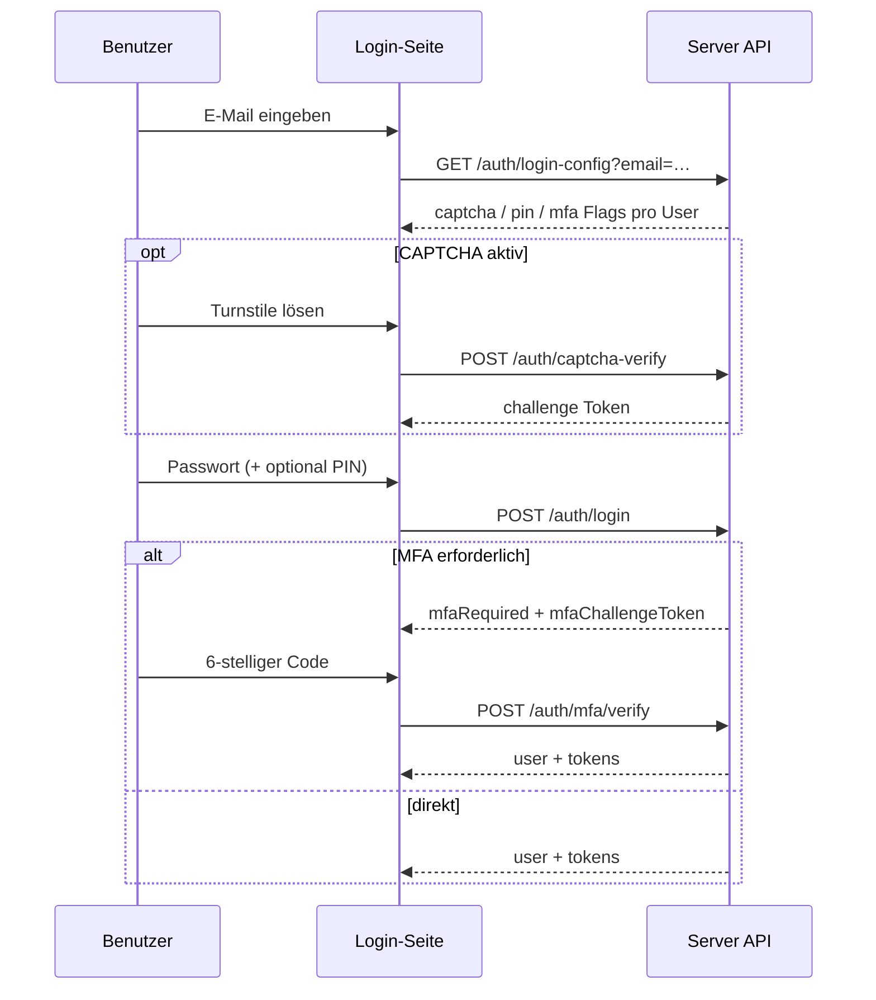

# Login-Sicherheit (Server Edition)

Optionale, unabhängig schaltbare Sicherheitsschichten für den **öffentlichen Server-Login** (Browser / Thin Client). Alle drei Layer sind **pro Workspace** aktivierbar und wirken nur zusammen mit dem bestehenden Passwort-Login — sie ersetzen ihn nicht.

| Layer | Zweck | Voraussetzung |
|-------|--------|----------------|
| **CAPTCHA** (Cloudflare Turnstile) | Bot-/Brute-Force-Dämpfung vor Credentials | `TURNSTILE_SITE_KEY` + `TURNSTILE_SECRET_KEY` |
| **PIN-Keypad** (6 Ziffern) | Schneller zweiter Faktor am gemeinsamen Arbeitsplatz | Pro Benutzer gesetzte PIN |
| **MFA** (TOTP oder E-Mail-Code) | Starker zweiter Faktor | Pro Benutzer aktiviertes TOTP oder E-Mail-MFA |

Stand: PR [#107](https://github.com/Puma7/SimpleCRMPublic/pull/107) — Migration `0020_auth_login_security`.

---

## Betreiber-Setup

### Pflicht vor Ersteinrichtung

`INITIAL_SETUP_TOKEN` muss in `docker/.env` gesetzt sein, **bevor** das erste Owner-Konto angelegt wird. Ohne Token lehnt `POST /api/v1/auth/initial-setup` ab (kein offenes Setup mehr).

```sh
# Generieren:
node -e "console.log(require('crypto').randomBytes(32).toString('base64url'))"
```

Im Setup-UI oder per API:

```http
POST /api/v1/auth/initial-setup
X-Initial-Setup-Token: <token aus .env>
Content-Type: application/json

{"email":"owner@example.com","password":"…","workspaceName":"Acme"}
```

Siehe auch [SETUP_SERVER.md](SETUP_SERVER.md).

### CAPTCHA (Turnstile)

In `docker/.env`:

```env
TURNSTILE_SITE_KEY=…
TURNSTILE_SECRET_KEY=…
```

Beide Keys müssen gesetzt sein, damit der Provider aktiv wird. In den Workspace-Einstellungen (**Einstellungen → Sicherheit → Login-Sicherheit**) CAPTCHA separat einschalten.

Turnstile-Verifikation hat ein **5-Sekunden-Timeout** — hängende Provider-Antworten blockieren den Login nicht unbegrenzt.

### Workspace-Toggles (Admin)

**Einstellungen → Sicherheit → Login-Sicherheit** (nur Admin):

- CAPTCHA aktivieren
- PIN-Keypad aktivieren
- MFA aktivieren (mit Unterwahl TOTP / E-Mail)

Einstellungen liegen in `sync_info` (Keys `auth_security_*`). PATCH auf `/api/v1/auth/security-settings` ist **partiell** — nur gesendete Felder werden geändert.

### Benutzer-Verwaltung (PIN / MFA)

**Einstellungen → Benutzer**:

- **PIN setzen / ändern / zurücksetzen** (Admin oder eigener Account)
- **TOTP einrichten** (QR + Bestätigungscode)
- **E-Mail-MFA aktivieren** (Code per Invite-SMTP)
- **MFA deaktivieren**

Wichtig: Wenn Workspace-PIN aktiv ist, aber ein Admin **keine eigene PIN** hat, erscheint eine Warnung in den Sicherheitseinstellungen. Der PIN-Keypad-Schritt erscheint im Login nur, wenn `loginConfig.user.pinRequired === true` (Benutzer hat PIN gesetzt).

---

## Login-Ablauf (Browser)



1. **Login-Config laden** bei E-Mail-Änderung (`GET /api/v1/auth/login-config?email=…`).
2. **CAPTCHA** (falls aktiv): Turnstile-Widget → `POST /api/v1/auth/captcha-verify` → `captchaChallenge` im Login-Body.
3. **Passwort** (+ **PIN**, falls `pinRequired`): `POST /api/v1/auth/login`.
4. **MFA** (falls `mfaRequired`): zweiter Schritt mit `POST /api/v1/auth/mfa/verify`.

PIN-Eingabe wird nach E-Mail-Wechsel zurückgesetzt.

---

## API-Endpunkte

| Methode | Pfad | Auth | Beschreibung |
|---------|------|------|--------------|
| GET | `/api/v1/auth/login-config` | — | Öffentliche Login-Konfiguration (+ optional User-Hints per `email`) |
| POST | `/api/v1/auth/captcha-verify` | — | Turnstile-Token → serverseitige Challenge |
| POST | `/api/v1/auth/login` | — | Passwort-Login; kann `mfaRequired` zurückgeben |
| POST | `/api/v1/auth/mfa/verify` | — | MFA-Challenge abschließen |
| GET/PATCH | `/api/v1/auth/security-settings` | Admin | Workspace-Toggles |
| POST | `/api/v1/auth/users/{id}/pin` | Admin / self | PIN setzen |
| DELETE | `/api/v1/auth/users/{id}/pin` | Admin / self | PIN entfernen |
| POST | `/api/v1/auth/users/{id}/mfa/totp/setup` | Admin / self | TOTP-Secret + otpauth-URI |
| POST | `/api/v1/auth/users/{id}/mfa/totp/confirm` | Admin / self | TOTP aktivieren |
| POST | `/api/v1/auth/users/{id}/mfa/email` | Admin / self | E-Mail-MFA aktivieren |
| DELETE | `/api/v1/auth/users/{id}/mfa` | Admin / self | MFA deaktivieren |

OpenAPI: `/api/v1/openapi.json` (Server-Modus).

---

## Datenmodell (Migrationen 0020, 0033 und 0034)

Neue Spalten auf `users`:

- `login_pin_hash`, `login_pin_enabled`
- `mfa_enabled`, `mfa_method` (`totp` | `email`)
- `mfa_totp_secret_id` (Verweis auf den verschluesselten Secret-Port)

`auth_mfa_email_codes` speichert Workspace, Benutzer, Code-Hash, Ablauf,
Verbrauchszeit und den Zustellstatus `pending`, `sent`, `failed` oder
`superseded`. RLS ist
fuer die Tabelle erzwungen. Nur erfolgreich als `sent` aktivierte Codes koennen
einen Login abschliessen; SMTP-Netzwerk-I/O laeuft ausserhalb der kurzen
Reservierungs- und Aktivierungstransaktionen.

Workspace-Flags in `sync_info` (siehe `packages/core/src/auth/login-security-settings.ts`).

---

## Sicherheitsverhalten (Kurz)

- **Fail-closed**: ungültige CAPTCHA-Challenge, PIN, MFA oder deaktivierter User → kein Token.
- **MFA-Challenge** ist single-use (In-Memory-Store + Verbrauch bei Erfolg).
- **E-Mail-MFA-Code** wird atomar per `UPDATE … RETURNING` konsumiert (Race-sicher).
- **E-Mail-MFA-Zustellung** reserviert konkurrierende Anforderungen pro Benutzer und haelt waehrend SMTP keine DB-Transaktion offen.
- **Login-Failure-Counter** (Brute-Force) in einer Transaktion inkrementiert.
- **INITIAL_SETUP_TOKEN** verhindert unbemerktes Owner-Takeover bei exponiertem Setup-Endpunkt.

Details und Restrisiken: [THREAT_MODEL.md](THREAT_MODEL.md), Learnings: [LEARNINGS_AUTH.md](LEARNINGS_AUTH.md).

---

## Verwandte Audit-Fixes (gleicher PR)

Nicht Login-UI, aber Betriebsstabilität:

| Thema | Datei | Verhalten |
|-------|-------|-----------|
| Compose SMTP-Outbox | `mail-compose-send.ts` | `sync_info`-Claim `outbox` vor SMTP; Retry ohne Duplikat |
| Forward-Copy Dedup | `workflow-forward-copy.ts` | Dedup vor SMTP; Rollback bei Fehler |
| Workflow IMAP | `workflow-execution.ts` | IMAP nach DB-Commit (deferred queue) |
| Custom Fields Batch | `customer-custom-field-values` | `?customerIds=1,2,3` statt N+1 |

Siehe [LEARNINGS_EMAIL.md](LEARNINGS_EMAIL.md) und [LEARNINGS_WORKFLOW.md](LEARNINGS_WORKFLOW.md).
