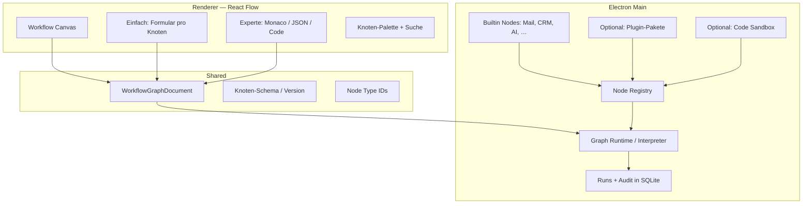
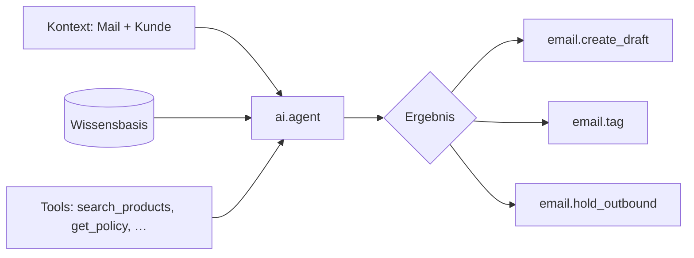
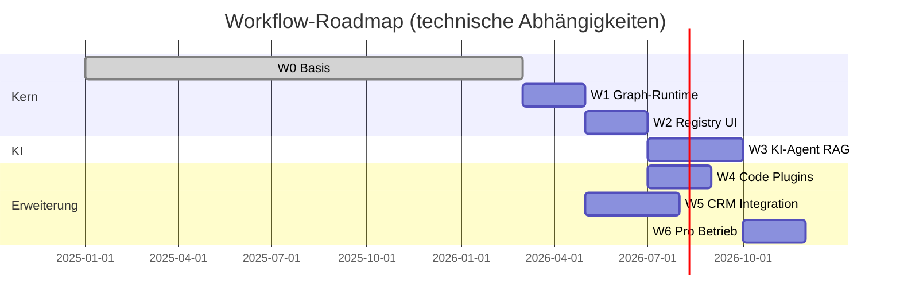

# Workflow-Vision — Automatisierung wie n8n, eingebettet in SimpleCRM

Dieses Dokument beschreibt **Zielbild, geplanten Umfang und Roadmap** für das Workflow-System in SimpleCRM (Desktop/Electron). Es ergänzt die Ist-Dokumentation:

| Dokument | Inhalt |
|----------|--------|
| [`EMAIL_PHASES.md`](EMAIL_PHASES.md) | Umsetzungs-Checkliste E-Mail (Phasen 1–4) |
| [`DEVELOPER_EMAIL.md`](DEVELOPER_EMAIL.md) | Technische Landkarte E-Mail & Workflows (heute) |
| [`email-system-deep-review.md`](email-system-deep-review.md) | Risiken, Invarianten, Review-Stand |

**Leserschaft:** Produkt, Entwicklung, LLM-Assistenten bei größeren Refactors.

---

## 1. Leitidee

> **Möglichst viel Geschäftslogik — E-Mail, CRM, KI, Integrationen — läuft über visuelle Flows (React Flow).**  
> Laien bedienen sich an Formularen im Canvas; Profis können dieselben Knoten per Code/JSON erweitern oder eigene Knoten registrieren.

SimpleCRM ist **kein Cloud-n8n**: Daten liegen lokal (SQLite), Secrets im OS-Keychain. Die Vision übernimmt n8n-**Denkweise** (Trigger → Logik → Aktionen), nicht die Multi-Tenant-Cloud.

### Designprinzipien

1. **Flow-first** — Automatisierung ist Standardweg, nicht Sonderfall.
2. **Zwei Bedienmodi** — „Einfach“ (GUI/WYSIWYG) und „Experte“ (Code, Roh-JSON, eigene Knoten).
3. **Fail-closed bei Risiko** — Ausgehende Mails, KI-Freigaben, Löschungen: lieber blockieren als still falsch handeln.
4. **Revisionssicherheit** — Kein hartes Löschen von Mail-Inhalten ohne explizite Nutzerentscheidung; Agenten erzeugen eher **Entwürfe** als Auto-Send.
5. **Erweiterbarkeit ohne Fork** — Neue Knoten über Registry/Plugins, nicht nur durch App-Releases.
6. **Desktop-tauglich** — Keine lang laufenden Server-Prozesse; Workflows in Electron-Main mit Mutex, Timeouts, klaren Logs.

---

## 2. Ist-Zustand (Kurz)

### 2.1 UI: React Flow als Editor

- Pfad: `src/app/email/workflows/`, Canvas: `@xyflow/react`
- Knotentypen im Canvas: **Trigger**, **Bedingung**, **Aktion** (fest verdrahtet)
- Speicherung: `email_workflows.graph_json` (Graph) + `definition_json` (kompilierte Regeln)
- JSON-Drawer: Entwickler-Ansicht des **Kompilats** (wird beim Speichern aus dem Graph neu erzeugt)

### 2.2 Laufzeit: Regel-Engine (nicht Graph-Interpreter)

```
React Flow Graph  →  compileGraphToDefinition()  →  WorkflowDefinitionV1 { rules[] }
                                                          ↓
                                              email-workflow-engine.ts
```

| Trigger | Beschreibung |
|---------|----------------|
| `inbound` | Nach IMAP/POP3-Sync (neue Nachricht) |
| `outbound` | Vor SMTP-Versand (fail-closed möglich) |
| `draft_created` | Lokaler Entwurf angelegt |
| `schedule` | Cron; optional Sync eines Kontos |

| Bedingungen (Auszug) | Operatoren |
|----------------------|------------|
| Betreff, Text, Von/An/CC, kombiniert | `contains`, `equals`, `regex`, `domain_ends_with` |
| Anhänge (`has_attachments`, Dateiname, MIME) | `is_true` / `is_false`, `contains`, … |
| Gruppen | `all`, `any`, `not` (Verzweigung im Graph) |

| Aktionen (Auszug) | |
|-------------------|--|
| Tag, gelesen, archivieren, Kategorie, Kunde verknüpfen | |
| `forward_copy`, `hold_outbound`, `tag_attachment_meta` | |
| `ai_review` (Prompt → OK/BLOCK) | |
| `stop` | |

**Bereits umgesetzt (jenseits reiner Regeln):** If/Else im Graph-Compiler (`ja`/`nein`-Kanten), Postfach-UI (gelesen, weiterleiten, Spam), Konto bearbeiten/löschen, Composer-Anhänge, IMAP `\Seen`-Sync (best-effort).

**Noch nicht n8n-like:**

- Keine beliebigen Knotentypen zur Laufzeit
- Kein Code-Knoten (JavaScript/Python)
- Kein KI-Agent mit Wissensbasis/Tools
- Kein echter Profi-Modus (editierbares Knoten-JSON, das die Engine direkt ausführt)
- Keine Integrationen außerhalb E-Mail/CRM (JTL, Kalender, …) als Workflow-Knoten

---

## 3. Zielbild: Architektur

### 3.1 Schichten



### 3.2 Zwei Ausführungsmodi (Übergang)

| Phase | Modell | Vorteil |
|-------|--------|---------|
| **Heute** | Graph → Compiler → `rules[]` → Engine | Einfach, testbar, wenig Magie |
| **Ziel** | Graph → **Interpreter** (Knoten für Knoten) | Verzweigungen, Schleifen, parallele Pfade, dynamische Knoten |

Der Compiler kann **optional** bleiben (Export, Migration, schnelle Vorschau). Die **Source of Truth** zur Laufzeit wird der **Graph** (versioniert).

### 3.3 Kontext-Objekt (`WorkflowContext`)

Jeder Knoten erhält ein strukturiertes Kontext-Objekt (nicht nur flache Strings):

```typescript
// Ziel-Typ (konzeptionell)
type WorkflowContext = {
  trigger: WorkflowTrigger;
  message?: EmailMessageSnapshot;
  compose?: OutboundComposeSnapshot;
  customer?: CustomerSnapshot;
  account?: EmailAccountSnapshot;
  variables: Record<string, string | number | boolean | null>;
  ai?: { lastResponse?: string; tokensUsed?: number };
  run: { workflowId: number; runId: number; stepIndex: number };
};
```

Platzhalter in Prompts und Code: `{{message.subject}}`, `{{customer.name}}`, `{{variables.retouren_link}}`.

---

## 4. Knoten-Taxonomie (geplanter Gesamtumfang)

### 4.1 Trigger-Knoten

| ID (geplant) | Beschreibung | Status |
|--------------|--------------|--------|
| `email.inbound` | Eingehende Mail nach Sync | ✅ |
| `email.outbound` | Vor Versand | ✅ |
| `email.draft_created` | Entwurf erstellt | ✅ |
| `schedule.cron` | Zeitplan + optional Sync | ✅ |
| `crm.customer_created` | Neuer Kunde | 🔲 |
| `crm.deal_stage_changed` | Deal-Phase geändert | 🔲 |
| `task.due` | Aufgabe fällig / überfällig | 🔲 |
| `calendar.event_start` | Termin beginnt (Erinnerung) | 🔲 |
| `manual.run` | Button „Workflow jetzt ausführen“ | 🔲 |
| `webhook.incoming` | HTTP-Webhook (optional, lokal) | 🔲 |

### 4.2 Logik-Knoten

| ID | Beschreibung | Status |
|----|--------------|--------|
| `logic.if` | Bedingung mit Ja/Nein-Ausgang | ✅ (über Bedingungsknoten + Compiler) |
| `logic.switch` | Mehrfach-Verzweigung nach Wert | 🔲 |
| `logic.merge` | Pfade zusammenführen | 🔲 |
| `logic.loop` | Über Liste (Tags, Anhänge, Zeilen) | 🔲 |
| `logic.delay` | Warten (Minuten/Stunden, nur Desktop-tauglich) | 🔲 |
| `logic.set_variable` | Variable setzen | 🔲 |
| `logic.filter` | CRM-/Mail-Filter ohne Code | 🔲 |

### 4.3 E-Mail-Aktionen

| ID | Beschreibung | Status |
|----|--------------|--------|
| `email.tag` | Tag setzen | ✅ |
| `email.mark_seen` | Lokal + optional IMAP `\Seen` | ✅ |
| `email.archive` | Archivieren | ✅ |
| `email.set_category` | Kategorie/Ordner logisch | ✅ |
| `email.link_customer` | Kunde verknüpfen | ✅ |
| `email.forward_copy` | Kopie per SMTP | ✅ |
| `email.hold_outbound` | Versand sperren | ✅ |
| `email.create_draft` | Antwort-/Fwd-Entwurf erzeugen | 🔲 |
| `email.move_imap` | IMAP-Ordner (Spam, Trash, …) | 🔲 |
| `email.delete_server` | Server-Löschung (opt-in, konfigurierbar) | 🔲 |

### 4.4 CRM-Aktionen

| ID | Beschreibung | Status |
|----|--------------|--------|
| `crm.link_customer` | Wie heute | ✅ (als `link_customer`) |
| `crm.create_task` | Aufgabe aus Mail | 🔲 |
| `crm.update_deal` | Deal-Feld / Stage | 🔲 |
| `crm.log_activity` | Follow-up-Timeline | 🔲 |
| `crm.set_custom_field` | Benutzerdefiniertes Feld | 🔲 |

### 4.5 KI-Knoten

| ID | Beschreibung | Status |
|----|--------------|--------|
| `ai.review` | Prompt + BLOCK/OK (Outbound/Inbound) | ✅ (`ai_review`) |
| `ai.transform_text` | Text umschreiben (wie Composer) | 🔲 (nur manuell im Composer) |
| `ai.classify` | Kategorie/Tag aus Inhalt | 🔲 |
| `ai.agent` | Agent mit System-Prompt + optional RAG | 🔲 |
| `ai.agent_tool` | Sub-Tool-Aufruf (intern) | 🔲 |

**KI-Agent-Knoten (Ziel-Detail):**



- **Wissensbasis (RAG):** lokale Quellen — CRM-Texte, Notizen, hochgeladene FAQ-Dateien, optional indexiert (Embeddings in SQLite oder Sidecar).
- **Tools:** typisierte Funktionen, keine freie Shell.
- **Human-in-the-loop:** Standard = Entwurf + Toast; Auto-Send nur mit explizitem Workflow-Schalter + Warnung.

### 4.6 Integrations-Knoten

| ID | Beschreibung | Status |
|----|--------------|--------|
| `jtl.create_order` | JTL-Auftrag (bestehendes IPC) | 🔲 |
| `mssql.query` | Read-only Abfrage (gespeicherte Verbindung) | 🔲 |
| `http.request` | HTTP GET/POST mit Allowlist | 🔲 |
| `sync.run` | Daten-Sync auslösen | 🔲 |

### 4.7 Code- & Erweiterungs-Knoten

| ID | Beschreibung | Status |
|----|--------------|--------|
| `code.javascript` | JS-Snippet in Sandbox | 🔲 |
| `code.python` | Python-Subprozess (optional) | 🔲 |
| `plugin.custom` | Registriertes npm-Plugin | 🔲 |

**API-Vertrag für Code-Knoten (Ziel):**

```javascript
// Eingebettet: async function run(ctx, libs) { … return { ok: true, variables: { … } }; }
// libs: sichere Helfer (fetch mit Allowlist, JSON, Datum, CRM-Lookup)
```

| Anforderung | Umsetzung |
|-------------|-----------|
| Timeout | z. B. 30 s |
| Speicher | begrenzt |
| Netzwerk | Allowlist-Domains in Einstellungen |
| Secrets | nur über `ctx.getSecret('…')` → Keytar |
| Fehler | `fail-closed` oder konfigurierbarer `onError`-Zweig |

**Sprachen-Priorität:** TypeScript-Builtins zuerst → **JavaScript-Sandbox** → Python nur bei konkretem Bedarf (Deployment, `python3` auf dem System).

---

## 5. Node Registry & Plugins

### 5.1 Registry-Struktur (Ziel)

```typescript
type WorkflowNodeDefinition = {
  type: string;                    // z.B. "ai.agent"
  version: 1;
  label: string;                   // DE-UI
  category: 'trigger' | 'logic' | 'action' | 'ai' | 'integration' | 'code';
  inputs: PortSchema[];
  outputs: PortSchema[];             // z.B. success / error / yes / no
  configSchema: JSONSchema;        // für „Einfach“-Formular
  defaultConfig: Record<string, unknown>;
  execute: (ctx: WorkflowContext, config: unknown) => Promise<NodeResult>;
  validateConfig?: (config: unknown) => string | null;
};
```

- **Builtin-Registry:** `electron/workflow/nodes/*.ts` — mit App ausgeliefert.
- **Plugin-Registry:** Ordner `~/.config/simplecrm/workflow-plugins/` oder konfigurierbarer Pfad; Manifest `simplecrm.workflow-plugin.json`.

### 5.2 UI: Einfach vs. Experte

| Modus | Zielgruppe | UI |
|-------|------------|-----|
| **Einfach** | Laien | React-Form aus `configSchema`; Labels auf Deutsch; Vorschau-Beispiele |
| **Experte** | Profis | Monaco-Editor für `code.javascript`; Roh-JSON pro Knoten; Diff beim Speichern |

Der JSON-Drawer heute wird zum **Experten-Panel pro Workflow oder pro Knoten** — editierbar, validiert, **nicht** still überschrieben (außer „Aus Graph neu generieren“ explizit).

### 5.3 React Flow

React Flow bleibt **Canvas + Interaktion** (Drag, Zoom, Kanten, MiniMap). Zusätzlich geplant:

- Dynamische `nodeTypes` aus Registry
- Kanten-Labels (`ja`/`nein`/Fehler) editierbar im Eigenschaften-Panel
- Subflows / gruppierte Bereiche (später)
- Template-Bibliothek („Retouren-Anfrage“, „Rechnung routing“, …)

---

## 6. Daten & Observability

### 6.1 Persistenz (Erweiterung)

| Tabelle / Feld | Zweck |
|----------------|--------|
| `email_workflows` | wie heute + `engine_version`, `execution_mode` (`compiled` \| `graph`) |
| `email_workflow_runs` | Lauf-Log (heute) |
| `email_workflow_run_steps` | **neu:** pro Knoten: Input/Output-Snapshot, Dauer, Fehler |
| `workflow_knowledge_bases` | **neu:** RAG-Chunks, Quelle, Embedding-Ref |
| `workflow_variables` | **neu:** Lauf-Variablen (optional verschlüsselt) |

### 6.2 UI für Betrieb

- Run-Historie pro Workflow (Timeline der Knoten)
- „Test mit Beispiel-Mail“ / Dry-Run ohne Seiteneffekte
- Export/Import von Flows (JSON, versioniert)

---

## 7. Sicherheit & Compliance (Desktop)

| Thema | Richtlinie |
|-------|------------|
| Secrets | Nie in `graph_json`; Keytar / OAuth wie E-Mail heute |
| KI-Daten | Optional: keine Volltexte an API ohne Einstellung; lokale Modelle später |
| Code-Knoten | Sandbox, Timeout, keine `require('fs')` ohne Policy |
| DSGVO | Runs/Logs retention konfigurierbar; Export wie `email-gdpr-export` erweitern |
| Revision | Kein Auto-Delete auf Server ohne expliziten Knoten + Bestätigung |

---

## 8. Roadmap (Phasen)

### Phase W0 — Basis (✅ weitgehend)

- E-Mail-Trigger, Regel-Engine, React-Flow-Editor
- CRM-Verknüpfung, Kategorien, Outbound fail-closed
- If/Else-Compiler, `ai_review`, Postfach-Lücken aus Testbericht

### Phase W1 — Graph-Runtime MVP

**Ziel:** Interpreter führt `graph_json` direkt aus; Compiler nur noch Legacy/Export.

| Lieferung | |
|-----------|--|
| `WorkflowRuntime` mit topological walk / DFS | |
| Einheitliches `WorkflowContext` | |
| Run-Steps in DB | |
| Test-Button „Workflow mit Nachricht #123“ | |

### Phase W2 — Registry & UI-Dualmodus

| Lieferung | |
|-----------|--|
| `WorkflowNodeRegistry` + Builtin-Paket `email.*`, `crm.*` | |
| Dynamische Palette | |
| Experten-JSON pro Knoten (validiert, nicht überschrieben) | |
| Template-Galerie (3–5 Standard-Flows) | |

### Phase W3 — KI-Agent

| Lieferung | |
|-----------|--|
| Knoten `ai.agent` mit Prompt + Modell-Einstellungen | |
| Wissensbasis: CRM-Notizen + Markdown/TXT-Upload | |
| Embeddings (lokal oder API) | |
| Tools: `search_customer`, `get_canned`, `create_draft` | |
| UI: Wissensbasis-Verwaltung unter E-Mail-Einstellungen | |

### Phase W4 — Code-Knoten & Plugins

| Lieferung | |
|-----------|--|
| `code.javascript` (isolated-vm oder vm2 mit harter API) | |
| Plugin-Manifest + Loader | |
| Dokumentation „Eigenen Knoten schreiben“ | |
| Optional: `code.python` via Subprozess | |

### Phase W5 — Querschnitt CRM & Integrationen

| Lieferung | |
|-----------|--|
| Trigger/Aktionen Deals, Tasks, Kalender | |
| JTL-/HTTP-Knoten mit Allowlist | |
| `logic.loop`, `logic.delay` | |

### Phase W6 — Pro & Betrieb

| Lieferung | |
|-----------|--|
| Subflows, Versionierung, Import/Export | |
| Performance (Batch, Queue bei Massen-Backfill) | |
| Erweiterte Reporting-Metriken pro Workflow | |



*(Monate sind orientierend für Reihenfolge, keine Kalenderzusage.)*

---

## 9. Bewusst außerhalb des Scopes (vorerst)

| Thema | Begründung |
|-------|------------|
| Omni-Channel (WhatsApp, Telefonie) | Anderes Produktmodul |
| Multi-User-Echtzeit-Kollaboration am Graph | Desktop-first, kein Shared Server |
| Vollständige n8n-Kompatibilität / Import | Eigenes Schema, ggf. später Export-Subset |
| Beliebige Shell-Befehle in Flows | Sicherheitsrisiko auf Desktop |
| Vollautomatischer Mail-Versand ohne User | Rechtlich/operativ selten gewünscht |

---

## 10. Erfolgskriterien (Definition of Done pro Vision)

1. **Laien:** Neuer Mitarbeiter kann mit Template „Eingehend: Rechnung sortieren“ in &lt; 15 Minuten einen produktiven Flow anlegen — ohne Code.
2. **Profis:** Gleicher Flow kann um einen `code.javascript`-Knoten erweitert werden, ohne den Graph neu zu zeichnen.
3. **KI:** Agent-Knoten beantwortet „Retourenlabel?“ mit Link aus Wissensbasis und legt einen **Entwurf** an.
4. **Betrieb:** Jeder Lauf ist in der UI nachvollziehbar (welcher Knoten, welcher Fehler).
5. **Sicherheit:** Fehlgeschlagener Outbound-Workflow blockiert Versand (fail-closed) — wie heute, auch nach Runtime-Umstellung.

---

## 11. Referenz-Implementierung (Dateien heute)

| Bereich | Pfad |
|---------|------|
| Typen & Bedingungen | `electron/email/email-workflow-types.ts` |
| Engine | `electron/email/email-workflow-engine.ts` |
| Graph → Regeln | `electron/email/email-workflow-graph-compile.ts` |
| Graph-Typen Shared | `shared/email-workflow-graph.ts` |
| UI Canvas | `src/components/email/workflow/workflow-canvas.tsx` |
| UI Shell / Speichern | `src/components/email/workflow/workflow-shell.tsx` |
| Store | `electron/email/email-workflow-store.ts` |

Bei Umsetzung von **W1+** neue Pakete vorgesehen:

```
electron/workflow/
  runtime.ts
  registry.ts
  context.ts
  nodes/
    email/
    crm/
    ai/
    code/
```

---

## 12. Zusammenfassung

| Frage | Antwort |
|-------|---------|
| React Flow für „alles über den Flow“? | **Ja, das ist das Zielbild.** Heute: Canvas + Compiler + feste Knoten. |
| JS/Python-Custom-Knoten? | **Geplant** (W4), nicht produktiv. |
| GUI + Code für Profis? | **GUI ja**; echter Code-/JSON-Modus **geplant** (W2). |
| KI-Agent im Flow? | **Geplant** (W3); heute nur `ai_review`. |
| n8n-Parität? | **Subset** mit CRM-/Mail-Fokus und Desktop-Sicherheit — kein 1:1-Klon. |

Dieses Dokument ist die **verbindliche Planungsreferenz** für Workflow-Erweiterungen, bis einzelne Phasen in [`EMAIL_PHASES.md`](EMAIL_PHASES.md) oder ein eigenes `WORKFLOW_PHASES.md` ausdetailliert werden.

*Letzte Aktualisierung: Entwurf nach Produkt-Feedback (Flow-first, n8n-ähnlich, KI-Agent, Code-Option).*
