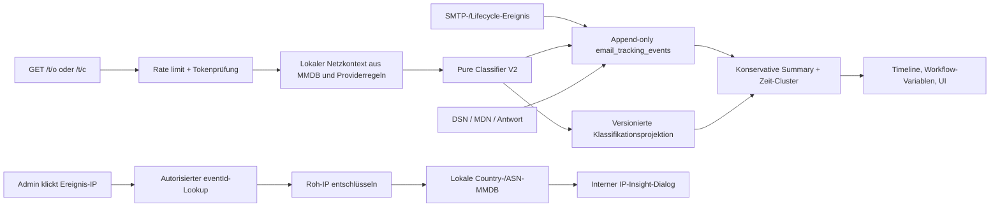

# E-Mail-Evidenz V2, interne IP-Auswertung und Composer-Tabfolge Implementation Plan

> **For agentic workers:** REQUIRED SUB-SKILL: Use superpowers:subagent-driven-development (recommended) or superpowers:executing-plans to implement this plan task-by-task. Steps use checkbox (`- [ ]`) syntax for tracking.

**Goal:** E-Mail-Evidenz konservativ und nachvollziehbar klassifizieren, wiederholte Pixelabrufe ohne falsche Öffnungsversprechen darstellen, IP-Land und Netzbetreiber ausschließlich intern auflösen und die Tabfolge des E-Mail-Composers von Betreff direkt in den Nachrichteneditor führen.

**Architecture:** Die unveränderlichen Evidenzereignisse bleiben append-only; eine neue versionierte Klassifikationsprojektion trennt Systemereignisse, unbekannte Abrufe, Mail-/Privacy-Proxys, Scanner und wahrscheinlich menschliche Interaktionen. IP-Auswertung erfolgt on demand gegen lokal gemountete MaxMind-GeoLite2-Country- und ASN-Datenbanken, nie durch Übermittlung einer Ereignis-IP an einen Webdienst. Der öffentliche Tracking-Endpunkt bleibt schnell und ausfallsicher; fehlende oder blockierte Pixel werden ausdrücklich als fehlendes Signal behandelt.

**Tech Stack:** TypeScript 7, Node.js 24, Fastify-Server-Edition, PostgreSQL/Kysely/RLS, React, Quill, Jest, Docker Compose, `@maxmind/geoip2-node`, GeoLite2 Country + ASN, pnpm 11.

## Global Constraints

- Keine Tarnung von Trackingpixeln und keine Umgehung von Proton-, Apple-, Gmail- oder anderen Tracking-Schutzmechanismen.
- Ein Pixelabruf ist niemals ein Beweis, dass eine Person die E-Mail gelesen hat.
- SMTP `250` bedeutet nur Annahme durch den angesprochenen SMTP-Server, nicht bestätigte Inbox-Zustellung.
- IP-Standort ist näherungsweise Infrastrukturstandort, niemals Wohnort oder sicherer Aufenthaltsort des Empfängers.
- Keine Ereignis-IP darf für Geo-/ASN-Auflösung an einen externen Lookup-Dienst gesendet werden.
- GeoIP-/ASN-Lookups sind opt-in, admin-only und nur möglich, solange verschlüsselte Roh-IP-Daten vorhanden sind.
- MaxMind-Zugangsdaten bleiben ausschließlich Server-/Docker-Secrets; sie werden weder in PostgreSQL noch im Renderer gespeichert oder geloggt.
- Fehlende, veraltete oder beschädigte MMDB-Dateien deaktivieren nur IP-Insights und Proxy-Zusatzsignale; Versand und Tracking-Endpunkte bleiben verfügbar.
- Bestehende Ereignistypen und Workflow-Variablen bleiben kompatibel; präzisere V2-Felder werden additiv eingeführt.
- Alle Änderungen werden testgetrieben umgesetzt; jeder Task beginnt mit einem nachweislich fehlschlagenden Regressionstest.

---

## 1. Ausgangsbefund und fachliche Zielwerte

### Aktuelle Fehlinterpretationen

1. `automated` bedeutet bei `queued`, `sending` und `smtp_accepted` lediglich „vom System erzeugt“, wird in der UI aber als „automatischer Abruf wahrscheinlich“ angezeigt.
2. Der Proxy-Classifier erkennt hauptsächlich User-Agent-Schlüsselwörter und einen Apple-Sonderfall (`17.*` innerhalb von fünf Sekunden). Ein Google-Proxy ohne den Text `GoogleImageProxy` wird deshalb zu `open_probable`.
3. `firstOpenedAt` und `lastOpenedAt` enthalten automatische und wahrscheinliche Abrufe gemeinsam, obwohl die UI sie „Öffnen“ nennt.
4. Die Minuten-Deduplizierung verhindert Ereignisfluten, verschluckt aber mehrere echte HTTP-Abrufe innerhalb derselben Minute.
5. Gmail/Proton/Apple können Bilder vorladen, cachen oder vollständig blockieren. Mehrfaches menschliches Öffnen erzeugt deshalb je nach Provider null, einen oder mehrere Abrufe.
6. Browser-, Betriebssystem- und Standortwerte eines Proxys werden derzeit zu leicht als Eigenschaften des Empfängers gelesen.

### Zielanzeige für das beobachtete Beispiel

```text
Versand: Vom SMTP-Server angenommen
Zustellung: Externe Mail-Infrastruktur hat Tracking-Asset abgerufen
Interaktion: Automatischer/Proxy-Abruf; menschliche Öffnung unbestätigt

Registrierte Pixelabrufe: 2
Automatisch/Proxy: 2
Unklassifiziert: 0
Wahrscheinlich menschlich: 0
Wahrscheinliche Öffnungssitzungen: 0
Erster Pixelabruf: 15.07.2026 21:22:10
Erste wahrscheinliche menschliche Öffnung: -
```

### Gewählte Ansätze

- **Gewählt:** regelbasierte, versionierte Klassifikation aus Headern, Timing, lokalem ASN/Netzkontext und kuratierten Providerregeln. Sie ist erklärbar, testbar und konservativ.
- **Nicht gewählt:** ein ML-Modell zur Mensch-/Bot-Erkennung. Es wäre für die vorhandene Datenmenge nicht belastbar und seine Scores wären gegenüber Nutzern schlecht erklärbar.
- **Gewählt:** lokale GeoLite2-Country-/ASN-MMDB-Dateien. Der offizielle Node-Reader arbeitet ohne Lookup-Webservice; GeoIP bleibt ausdrücklich ungefähr.
- **Nicht gewählt:** Links zu `ipinfo.io`, RIPEstat oder ähnlichen Seiten. Ein Klick würde die sensible IP an einen weiteren Anbieter übertragen.
- **Gewählt:** konservative Zeit-Cluster für „wahrscheinliche Öffnungssitzungen“ ohne dauerhaften Gerätefingerprint.
- **Nicht gewählt:** Zählung „wie oft der Kunde geöffnet hat“. Proxy-Caches und Blocker machen diese Aussage technisch unmöglich.

Referenzgrundlagen:

- Proton entfernt bekannte Tracker und lädt andere Remote-Bilder über eigene Infrastruktur vor; wiederholtes Öffnen kann dadurch keinen neuen Abruf erzeugen: https://proton.me/support/email-tracker-protection
- Google veröffentlicht Bereiche und Reverse-DNS-Muster für user-triggered Fetcher, warnt aber ausdrücklich, dass User-Agents spoofbar sind: https://developers.google.com/crawling/docs/crawlers-fetchers/google-user-triggered-fetchers
- MaxMind empfiehlt lokale Datenbank-Reader; GeoIP ist inhärent ungenau und darf nicht zur Bestimmung eines Haushalts verwendet werden: https://dev.maxmind.com/geoip/geolocate-an-ip/databases/

---

## 2. Ziel-Datenfluss



---

## 3. Datei- und Modulstruktur

| Datei | Verantwortung |
|---|---|
| `packages/core/src/email/tracking.ts` | Öffentliche Evidenztypen, pure Klassifikation und Summary-Semantik |
| `packages/server/src/email-tracking.ts` | Persistenz, Resolver, Timeline, Reclassification und Retention |
| `packages/server/src/email-tracking-ip-intelligence.ts` | Lokaler MMDB-Reader, private/reservierte Netze, Status und ASN/Country-Lookup |
| `packages/server/src/email-tracking-network-rules.ts` | Kuratierte Proxy-/Scannerregeln und Zuordnung des lokalen Netzkontexts |
| `packages/server/src/migrations/0030_email_evidence_classification_v2.ts` | Klassifikationsprojektionen, Policy-Feld und RLS |
| `packages/server/src/api/email-tracking-routes.ts` | Admin-only IP-Insight- und Reclassify-Routen |
| `packages/server/src/api/types.ts` | API-Port- und Response-Typen |
| `packages/server/src/config.ts`, `packages/server/src/server.ts` | MMDB-Pfade und Dependency Injection |
| `docker/docker-compose.yml`, `docker/.env.example` | Optionaler GeoIP-Updater und Read-only-Volume |
| `src/components/email/message-evidence-panel.tsx` | Präzisere Status-/Metriktexte und IP-Insight-Einstieg |
| `src/components/email/ip-insight-dialog.tsx` | Interne Country-/ASN-Detailansicht |
| `src/components/email/compose-quill-editor.tsx` | Explizite Editor-Focus-API |
| `src/components/email/compose-dialog.tsx` | Tab von Betreff direkt in Quill |
| `docs/EMAIL_EVIDENCE_TRACKING.md` | Grenzen, Betrieb, Datenschutz und neue Metriken |

---

### Task 1: Evidenzvertrag V2 und versionierte Klassifikationsprojektion

**Files:**
- Create: `packages/server/src/migrations/0030_email_evidence_classification_v2.ts`
- Modify: `packages/server/src/migrations/index.ts`
- Modify: `packages/server/src/db/schema.ts`
- Modify: `packages/core/src/email/tracking.ts`
- Test: `tests/unit/email-tracking-migration.test.ts`
- Test: `tests/unit/email-tracking.test.ts`

**Interfaces:**

```ts
export type EmailEvidenceActorClass =
  | 'system'
  | 'probable_human'
  | 'mail_proxy'
  | 'privacy_proxy'
  | 'security_scanner'
  | 'automated_unknown'
  | 'unknown';

export type EmailEvidenceClassification = Readonly<{
  version: 2;
  actorClass: EmailEvidenceActorClass;
  confidence: EmailEvidenceConfidence;
  reasons: readonly string[];
}>;
```

Neue Tabelle `email_tracking_event_classifications`:

```sql
event_id bigint NOT NULL REFERENCES email_tracking_events(id) ON DELETE CASCADE,
classification_version integer NOT NULL,
actor_class text NOT NULL,
confidence text NOT NULL,
reasons_json jsonb NOT NULL DEFAULT '[]'::jsonb,
classified_at timestamptz NOT NULL DEFAULT now(),
PRIMARY KEY (event_id, classification_version)
```

- [ ] **Step 1:** Migrationstest schreiben, der Tabelle, Checks, Foreign Key, RLS und Policy `ip_insights_enabled boolean NOT NULL DEFAULT false` verlangt.
- [ ] **Step 2:** `pnpm exec jest --runInBand tests/unit/email-tracking-migration.test.ts` ausführen; erwartet wird ein FAIL wegen fehlender Migration `0030`.
- [ ] **Step 3:** Migration, Kysely-Schema und Core-Typen implementieren. Historische Lifecycle-Ereignisse werden als `system`, alte `*_automated` als `automated_unknown` und alte `open_probable`/`click` konservativ als `unknown` projiziert.
- [ ] **Step 4:** Migration- und Core-Tests erneut ausführen; erwartet wird PASS.
- [ ] **Step 5:** Commit: `feat(email): add versioned evidence classifications`.

### Task 2: Lokale IP-Intelligence ohne Ereignis-IP-Leak

**Files:**
- Create: `packages/server/src/email-tracking-ip-intelligence.ts`
- Modify: `packages/server/package.json`
- Modify: `pnpm-lock.yaml`
- Modify: `packages/server/src/config.ts`
- Modify: `packages/server/src/server.ts`
- Create: `tests/unit/email-tracking-ip-intelligence.test.ts`
- Create: `tests/unit/server-config.test.ts`

**Interfaces:**

```ts
export type EmailTrackingIpInsight = Readonly<{
  ipAddress: string;
  ipFamily: 'ipv4' | 'ipv6';
  scope: 'public' | 'private' | 'loopback' | 'reserved' | 'unknown';
  countryCode: string | null;
  continentCode: string | null;
  asn: number | null;
  networkName: string | null;
  networkCidr: string | null;
  databaseBuildAt: string | null;
}>;

export interface EmailTrackingIpIntelligencePort {
  lookup(ip: string): Promise<EmailTrackingIpInsight>;
  status(): Readonly<{
    state: 'ready' | 'missing' | 'stale' | 'invalid';
    countryDatabaseBuildAt: string | null;
    asnDatabaseBuildAt: string | null;
  }>;
}
```

- [ ] **Step 1:** Tests mit kleinen MMDB-Fixtures schreiben: öffentliche IPv4/IPv6, unbekannte Adresse, private/loopback/reservierte Adresse, fehlende Datei, korrupte Datei und atomarer Reader-Wechsel nach mtime-Änderung.
- [ ] **Step 2:** `pnpm exec jest --runInBand tests/unit/email-tracking-ip-intelligence.test.ts` ausführen; erwartet wird FAIL, weil Port und Reader fehlen.
- [ ] **Step 3:** `@maxmind/geoip2-node` hinzufügen und einen langlebigen, read-only Reader implementieren. `GEOIP_COUNTRY_DB_PATH` und `GEOIP_ASN_DB_PATH` sind optional; weder Lookup noch Status dürfen Secrets oder Roh-IP loggen.
- [ ] **Step 4:** Fokustests und `pnpm run typecheck` ausführen; erwartet wird PASS.
- [ ] **Step 5:** Commit: `feat(server): add local email tracking ip intelligence`.

### Task 3: Konservativer Proxy-/Scanner-Classifier V2

**Files:**
- Create: `packages/server/src/email-tracking-network-rules.ts`
- Modify: `packages/core/src/email/tracking.ts`
- Modify: `packages/server/src/email-tracking.ts`
- Test: `tests/unit/email-tracking.test.ts`
- Test: `tests/unit/email-tracking-service.test.ts`

**Classifier-Input:**

```ts
export type EmailTrackingNetworkContext = Readonly<{
  asn: number | null;
  networkName: string | null;
  providerClass:
    | 'google_fetcher'
    | 'apple_privacy'
    | 'proton_proxy'
    | 'security_vendor'
    | 'hosting_or_cloud'
    | 'unknown';
}>;
```

**Regelpriorität:**

1. Expliziter Scanner-/Proxy-User-Agent oder Proxy-Header -> entsprechender automatisierter Actor.
2. Verifizierter lokaler Providernetz-Treffer -> `mail_proxy`, `privacy_proxy` oder `security_scanner`.
3. Abruf innerhalb von fünf Sekunden plus Mail-/Cloud-ASN oder synthetisches Proxy-Muster -> automatisiert; nie `probable_human`.
4. Abruf ohne User-Agent oder aus privatem/reserviertem Netz -> `unknown`.
5. Nur wenn keine Automationsregel greift und der Request plausibel ist -> `probable_human`, `medium`.
6. User-Agent allein kann Automatisierung bestätigen, aber niemals Menschlichkeit beweisen.

- [ ] **Step 1:** Regressionstests mit den beiden beobachteten Requests schreiben: `74.125.216.133` plus Drei-Sekunden-Abruf und `66.249.93.40` plus `GoogleImageProxy` müssen automatisiert sein; ein normaler später Direktabruf bleibt `probable_human`.
- [ ] **Step 2:** `pnpm exec jest --runInBand tests/unit/email-tracking.test.ts` ausführen; erwartet wird FAIL für den ersten Google-Proxy-Fall.
- [ ] **Step 3:** Pure V2-Regeln und Server-Netzkontext implementieren. Gründe bleiben maschinenlesbar, zum Beispiel `known_proxy_user_agent`, `known_provider_network`, `immediate_infrastructure_fetch`, `missing_client_identity`.
- [ ] **Step 4:** Tests für Header-Spoofing ergänzen: Google-Text aus einem fremden Netz bleibt automatisiert wegen UA, ein Google-ASN ohne Timing-/Proxy-Indiz bleibt `unknown` statt automatisch menschlich.
- [ ] **Step 5:** Commit: `fix(email): classify proxy opens conservatively`.

### Task 4: Wiederholte Abrufe, Deduplizierung und Öffnungssitzungen

**Files:**
- Modify: `packages/server/src/email-tracking.ts`
- Modify: `packages/core/src/email/tracking.ts`
- Test: `tests/unit/email-tracking-service.test.ts`
- Test: `tests/unit/email-tracking.test.ts`

**Summary-V2-Felder:**

```ts
pixelFetchCount: number;
automatedPixelFetchCount: number;
unknownPixelFetchCount: number;
probableHumanPixelFetchCount: number;
probableHumanOpenSessionCount: number;
firstPixelFetchedAt: string | null;
lastPixelFetchedAt: string | null;
firstProbableHumanOpenAt: string | null;
lastProbableHumanOpenAt: string | null;
```

- [ ] **Step 1:** Tests schreiben: zwei Abrufe derselben IP innerhalb neun Sekunden ergeben ein Ereignis; nach elf Sekunden zwei Ereignisse; wahrscheinliche menschliche Abrufe mit weniger als 30 Minuten Abstand ergeben eine Sitzung, ab 30 Minuten zwei Sitzungen.
- [ ] **Step 2:** Fokustests ausführen; erwartet wird FAIL durch die bisherige Minuten-Deduplizierung und fehlende V2-Summary.
- [ ] **Step 3:** Dedupe-Bucket auf zehn Sekunden umstellen, bestehende IP-/Token-Rate-Limits und 10.000-Ereignis-Cap beibehalten. Sessions ausschließlich zeitlich clustern; keinen dauerhaften Browser-/Gerätefingerprint erzeugen.
- [ ] **Step 4:** Kompatibilitätsfelder behalten: `openCount === pixelFetchCount`, `firstOpenedAt === firstPixelFetchedAt`, `lastOpenedAt === lastPixelFetchedAt`. Neue UI und neue Workflows verwenden nur die präziseren Namen.
- [ ] **Step 5:** Commit: `feat(email): separate pixel fetches from open sessions`.

### Task 5: Historische Neubewertung ohne Mutation der Evidenzereignisse

**Files:**
- Modify: `packages/server/src/email-tracking.ts`
- Modify: `packages/server/src/server.ts`
- Modify: `packages/server/src/api/email-tracking-routes.ts`
- Test: `tests/unit/email-tracking-service.test.ts`
- Test: `tests/unit/email-tracking-routes.test.ts`

**Interface:**

```ts
reclassifyMessage(input: {
  workspaceId: string;
  actorUserId: string;
  messageId: number;
}): Promise<{ classified: number; unavailableRaw: number }>;
```

- [ ] **Step 1:** Tests schreiben: Reclassification ergänzt Version 2, verändert `email_tracking_events` nicht, überspringt abgelaufene Rohdaten und ist bei erneutem Aufruf idempotent.
- [ ] **Step 2:** Fokustests ausführen; erwartet wird FAIL wegen fehlender Projektionserzeugung.
- [ ] **Step 3:** Admin-only Route `POST /api/v1/email/messages/:messageId/tracking/reclassify` implementieren. Pro Batch maximal 500 Ereignisse; entschlüsselte IP/UA bleiben nur im Speicher und werden nicht geloggt.
- [ ] **Step 4:** Timeline und Summary auf die höchste vorhandene Klassifikationsversion umstellen; ohne Projektion gilt konservativer Fallback `unknown`, niemals `probable_human`.
- [ ] **Step 5:** Commit: `feat(email): reclassify retained tracking evidence`.

### Task 6: Interner, autorisierter IP-Insight-Endpunkt

**Files:**
- Modify: `packages/server/src/api/types.ts`
- Modify: `packages/server/src/api/email-tracking-routes.ts`
- Modify: `packages/server/src/email-tracking.ts`
- Modify: `src/services/transport/channel-http-registry.ts`
- Modify: `shared/ipc/channels.ts`
- Test: `tests/unit/email-tracking-routes.test.ts`
- Test: `tests/unit/renderer-transport.test.ts`

**Route:**

```text
GET /api/v1/email/messages/:messageId/tracking/events/:eventId/ip-insight
```

Die IP steht absichtlich nicht in Pfad oder Query. Der Server lädt das Ereignis über `eventId`, erzwingt `workspace_id`, `message_id`, Adminrolle, `ip_insights_enabled`, vorhandene Rohdaten und gültige RLS-Sitzung.

- [ ] **Step 1:** Tests für unauthenticated `401`, Nicht-Admin `403`, fremden Workspace `404`, deaktivierte Policy `403`, abgelaufene Rohdaten `410`, fehlende MMDB `503` und erfolgreichen Lookup schreiben.
- [ ] **Step 2:** Fokustests ausführen; erwartet wird FAIL wegen fehlender Route.
- [ ] **Step 3:** Portmethode, Route und HTTP-Transport implementieren. Erfolgreiche und abgelehnte sensible Zugriffe erhalten Audit-Ereignisse ohne Roh-IP.
- [ ] **Step 4:** Response auf Country-Code, Kontinent-Code, ASN, Organisationsname, CIDR, DB-Build-Datum, IP-Familie und Scope begrenzen. Keine Koordinaten und standardmäßig keine Stadt speichern oder liefern.
- [ ] **Step 5:** Commit: `feat(server): expose internal tracking ip insight`.

### Task 7: Evidenz-UI mit ehrlichen Statuswerten und IP-Dialog

**Files:**
- Create: `src/components/email/ip-insight-dialog.tsx`
- Modify: `src/components/email/message-evidence-panel.tsx`
- Modify: `src/components/email/settings/tracking-settings-panel.tsx`
- Test: `tests/unit/message-evidence-panel.test.tsx`

**UI-Regeln:**

- Lifecycle-Zeilen zeigen niemals „automatischer Abruf wahrscheinlich“.
- `open_automated` zeigt Actor und Gründe, zum Beispiel „Google-Mailproxy“ oder „Security-Scanner“.
- `unknown` zeigt „Pixelabruf, Ursache unklar“, nicht „wahrscheinlich geöffnet“.
- Browser/OS/Gerät werden bei Proxy-/Scanner-Actors als „Abrufende Infrastruktur“ gruppiert.
- IP ist nur bei aktivierten sensiblen Rohdaten sichtbar und als Button mit `MapPin`-/`Network`-Icon bedienbar.
- Der Dialog trägt permanent den Hinweis „Ungefährer Standort der abrufenden Infrastruktur; kein Nachweis des Empfängerstandorts“.

- [ ] **Step 1:** Renderingtests für das konkrete Zwei-Google-Proxy-Beispiel schreiben; erwartet werden `2 / 2 / 0 / 0`, kein wahrscheinliches Öffnen und kein Empfängergerät „Chrome/Windows“.
- [ ] **Step 2:** Fokustest ausführen; erwartet wird FAIL mit dem aktuellen Status `Wahrscheinlich geöffnet`.
- [ ] **Step 3:** V2-Metriken, Statuscopy und `IpInsightDialog` implementieren. Country-Namen lokal im Renderer über `Intl.DisplayNames` aus dem ISO-Code erzeugen.
- [ ] **Step 4:** Tests für abgelaufene Rohdaten, fehlende MMDB, Ladefehler, Dialog-Abbruch, Admin-/Nicht-Admin-Sichtbarkeit und Reclassification-Button ergänzen.
- [ ] **Step 5:** Commit: `feat(ui): clarify email evidence and ip insights`.

### Task 8: Workflow-Verträge additiv erweitern

**Files:**
- Modify: `packages/core/src/email/tracking.ts`
- Modify: `packages/core/src/workflow/schema/email.ts`
- Modify: `packages/server/src/email-tracking.ts`
- Test: `tests/unit/email-tracking.test.ts`
- Test: `tests/unit/server-edition-foundation.test.ts`

**Neue Variablen:**

```text
tracking.pixel_fetch_count
tracking.automated_pixel_fetch_count
tracking.unknown_pixel_fetch_count
tracking.probable_human_pixel_fetch_count
tracking.probable_human_open_session_count
tracking.first_pixel_fetched_at
tracking.last_pixel_fetched_at
tracking.first_probable_human_open_at
tracking.last_probable_human_open_at
```

- [ ] **Step 1:** Tests schreiben, die alte Variablen unverändert und neue Variablen mit V2-Semantik erwarten.
- [ ] **Step 2:** Fokustests ausführen; erwartet wird FAIL wegen fehlender V2-Variablen.
- [ ] **Step 3:** Workflow-Mapping und Schema ergänzen. Bestehende Vorlage „Ohne Reaktion nachfassen“ darf nicht durch einen reinen Proxy-Abruf als menschlich geöffnet gelten; Klick oder Antwort bleiben stärkere Signale.
- [ ] **Step 4:** Regressionstests für SMTP-only, Proxy-only, unknown-fetch, probable-human, click und reply ausführen.
- [ ] **Step 5:** Commit: `feat(workflow): expose conservative tracking evidence`.

### Task 9: Composer-Tabfolge Betreff -> Nachricht

**Files:**
- Modify: `src/components/email/compose-quill-editor.tsx`
- Modify: `src/components/email/compose-dialog.tsx`
- Test: `tests/unit/compose-quill-editor.test.tsx`
- Test: `tests/unit/postfach-compose-ux.test.ts`
- Create: `tests/e2e/email-compose-tab-order.spec.ts`

**Interface:**

```ts
export type ComposeQuillEditorHandle = {
  focus: () => boolean;
  // bestehende Methoden bleiben unverändert
};
```

- [ ] **Step 1:** Unit-Test schreiben: `focus()` ruft `quill.focus()` auf, setzt bei fehlender Auswahl den Cursor ans Dokumentende und liefert bei nicht gemountetem Editor `false`.
- [ ] **Step 2:** Unit-Test schreiben: `Tab` auf dem Betreff verhindert nur die normale Vorwärtsnavigation und ruft `editorRef.current.focus()` auf; `Shift+Tab`, `Ctrl+Tab` und andere Tasten bleiben unverändert.
- [ ] **Step 3:** Tests ausführen; erwartet wird FAIL wegen fehlender Focus-API und fehlendem `onKeyDown`.
- [ ] **Step 4:** Minimal implementieren. Die Quill-Toolbar bleibt per Tastatur erreichbar und wird nicht global mit `tabIndex=-1` deaktiviert; nur der Vorwärtspfad vom Betreff wird explizit in den Editor gelenkt.
- [ ] **Step 5:** Playwright-Test ergänzen: `An -> Cc -> Bcc -> Betreff -> .ql-editor`; anschließend muss der Nutzer schreiben können und es darf keine Format-/Font-Schaltfläche fokussiert sein. Commit: `fix(email): focus message editor after subject tab`.

### Task 10: Docker-Betrieb, Datenschutz und Ausfallverhalten

**Files:**
- Modify: `docker/docker-compose.yml`
- Modify: `docker/.env.example`
- Modify: `docs/EMAIL_EVIDENCE_TRACKING.md`
- Modify: `docs/SETUP_SERVER.md`
- Modify: `packages/server/src/cli/doctor.ts`
- Test: `tests/integration/server-compose-static.test.ts`
- Test: `tests/unit/server-edition-foundation.test.ts`

- [ ] **Step 1:** Tests schreiben: GeoIP-Volume ist read-only im API-Container, Zugangsdaten landen nur im Updater, fehlende Variablen brechen den normalen Compose-Start nicht und Doctor meldet `ready/missing/stale/invalid` ohne Secrets.
- [ ] **Step 2:** Tests ausführen; erwartet wird FAIL wegen fehlender Compose-Konfiguration.
- [ ] **Step 3:** Optionales Compose-Profil `geoip` mit dem auf Digest fixierten Image `ghcr.io/maxmind/geoipupdate:v7.1.1@sha256:45e15eb310528fd308c5c0abee9a8e6d580f1e2b1251e960dec2863dc7f0102f` ergänzen. Der Updater erhält ausschließlich `GEOIPUPDATE_ACCOUNT_ID`, `GEOIPUPDATE_LICENSE_KEY`, `GEOIPUPDATE_EDITION_IDS="GeoLite2-Country GeoLite2-ASN"` und `GEOIPUPDATE_FREQUENCY=168`; sein Volume wird unter `/usr/share/GeoIP` beschreibbar gemountet. Dasselbe Volume wird im API-Container read-only unter `/var/lib/simplecrm/geoip` gemountet; dort zeigen `GEOIP_COUNTRY_DB_PATH=/var/lib/simplecrm/geoip/GeoLite2-Country.mmdb` und `GEOIP_ASN_DB_PATH=/var/lib/simplecrm/geoip/GeoLite2-ASN.mmdb` auf die Datenbanken. Ohne Profil und Zugangsdaten startet die API weiterhin ohne GeoIP-Funktion.
- [ ] **Step 4:** Dokumentieren: Aktivierung, Lizenz-/Attributionspflicht, Genauigkeitsgrenzen, Retention, Proton-/Gmail-/Apple-Caching, keine Tarnung, keine Beweiskraft persönlicher Kenntnisnahme und Verhalten bei fehlenden Datenbanken.
- [ ] **Step 5:** Commit: `docs(server): document local tracking ip intelligence`.

### Task 11: Gesamtabnahme, Security-Regressionen und Rollout

**Files:**
- Modify only if a failing verification exposes a defect.

- [ ] **Step 1:** Fokussuiten ausführen:

```powershell
pnpm exec jest --runInBand `
  tests/unit/email-tracking.test.ts `
  tests/unit/email-tracking-service.test.ts `
  tests/unit/email-tracking-routes.test.ts `
  tests/unit/email-tracking-ip-intelligence.test.ts `
  tests/unit/message-evidence-panel.test.tsx `
  tests/unit/compose-quill-editor.test.tsx
```

- [ ] **Step 2:** Sicherheitsfälle prüfen: manipulierte `eventId`, fremder Workspace, Nicht-Admin, deaktivierte Policy, gelöschte Rohdaten, private IP, überlange UA, defekte MMDB, Rate-Limit, 10.000-Event-Cap und konkurrierender Reclassify-Aufruf.
- [ ] **Step 3:** Vollprüfung ausführen:

```powershell
pnpm run check:typescript-toolchain
pnpm run lint
pnpm run typecheck
pnpm test
pnpm run test:mail
pnpm run test:server:coverage
pnpm run test:ui:coverage:check
pnpm run build
```

- [ ] **Step 4:** Manuelle Akzeptanzmatrix dokumentieren: Gmail (Proxy/Cache), Proton (Blocker/Preload), Apple Mail Privacy Protection, Outlook, Thunderbird mit Remote-Bildern an/aus, zweimaliges Öffnen innerhalb/außerhalb 30 Minuten, Klick, Antwort, DSN und Bounce.
- [ ] **Step 5:** Rollout hinter bestehendem Tracking-Opt-in: Migration zuerst, V2-Klassifikation aktivieren, GeoIP optional zuschalten, historische Nachricht manuell neu bewerten. Commit: `test(email): verify evidence validity rollout`.

---

## 4. Abnahmekriterien

- Das konkrete Beispiel mit den beiden Google-Proxy-IPs wird nicht mehr als wahrscheinlich menschlich geöffnet angezeigt.
- Lifecycle-Ereignisse tragen keine Abruf-Klassifizierung.
- Die UI unterscheidet Pixelabrufe, automatisierte Abrufe, unklassifizierte Abrufe, wahrscheinlich menschliche Abrufe und zeitlich geclusterte Öffnungssitzungen.
- Mehrfachöffnungen werden nur gezählt, wenn tatsächlich mehrere Requests eintreffen; die UI erklärt Caching und Blocking ausdrücklich.
- Eine von Proton blockierte Nachricht zeigt keine erfundene Öffnung und keinen negativen Beweis, sondern „Kein messbares Öffnungssignal“.
- IP-Insights werden ausschließlich serverintern aus lokalen Dateien ermittelt und sind nur für Owner/Admins mit aktivierter Rohdatenerfassung zugänglich.
- IP-Adressen erscheinen weder in Lookup-URLs noch in Applikations-, Caddy- oder Audit-Logs.
- Fehlende GeoIP-Daten beeinträchtigen weder Versand noch Pixel-/Klick-Endpunkte.
- Tab führt von `An` über `Cc`, `Bcc` und `Betreff` direkt in `.ql-editor`, ohne Formatierungssteuerelemente dazwischen.
- Alte API-/Workflow-Felder bleiben verfügbar; neue Automationen können die konservativen V2-Felder verwenden.

## 5. Bewusste Nicht-Ziele

- Kein Versuch, Tracker-Blocklisten durch wechselnde Domains, Dateinamen, CSS-Hintergründe, eingebettete Inhaltsbilder oder andere Tarnmaßnahmen zu umgehen.
- Keine Behauptung, eine bestimmte Person habe gelesen, nur weil ein Pixel oder Link abgerufen wurde.
- Keine exakte Stadt-, Gebäude- oder Personenortung.
- Kein geräteübergreifender Fingerprint und keine dauerhafte Empfängerprofilbildung.
- Keine externe IP-Lookup-API und kein Browser-Link, der die IP an Dritte überträgt.
- Keine automatische Aktivierung von Tracking oder IP-Insights bei bestehenden Workspaces.
