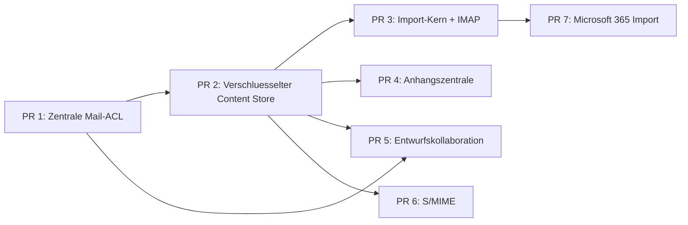

# Server-first Mail Platform Masterplan

> **For agentic workers:** REQUIRED SUB-SKILL: Use superpowers:subagent-driven-development (recommended) or superpowers:executing-plans to implement this plan task-by-task. Steps use checkbox (`- [ ]`) syntax for tracking.

**Goal:** Die Mailplattform server-first aufstellen und Mailbox-Rechte, verschluesselte Speicherung, Migration, Anhangszentrale, Kollaboration und S/MIME in kontrollierten, einzeln auslieferbaren Pull Requests umsetzen.

**Architecture:** Ein modularer Server-Monolith bleibt die einzige fachliche Autoritaet. Zentrale Mail-ACL und ein verschluesselter Content Store sind gemeinsame Plattformdienste; alle weiteren Funktionen verwenden ausschliesslich diese Grenzen. Desktop bleibt kompatibler Client, erhaelt aber keine neue lokale Parallelarchitektur.

**Tech Stack:** TypeScript 7, Fastify, PostgreSQL, Graphile Worker, React, pnpm, Jest, Playwright, IMAP, Microsoft Graph, PKI.js, XChaCha20-Poly1305.

## Global Constraints

- Referenzdesign: `docs/superpowers/specs/2026-07-19-server-first-mail-platform-design.md`.
- Alle Mailzugriffe sind serverseitig `default deny`; Owner und Administratoren besitzen den dokumentierten Vollzugriff.
- Kein neuer Mail-Endpunkt, Worker, Export oder WebSocket-Event darf die zentrale ACL umgehen.
- Kein Klartext fuer Betreff, Body, RFC822, Dateiname, Anhangstext, Kommentar oder Entwurfsrevision in PostgreSQL, Dateispeicher, Logs oder Events nach Abschluss der Content-Store-Migration.
- Migrationen sind expand-and-contract, wiederaufnehmbar und rollback-faehig; destruktive Contract-Schritte folgen erst nach Backfill-, Restore- und Betriebsnachweis.
- Historische Imports loesen standardmaessig keine Workflows, Antworten, KI-Vorschlaege oder Trackingereignisse aus.
- Keine Cloudspeicher-Anbindung, kein lokales Exchange/EWS, keine formale Freigabelogik und kein gleichzeitiges Live-Editing.
- Vor jedem PR ist zu pruefen, ob `packages/server/src/migrations/index.ts` inzwischen hoehere Nummern enthaelt; neue Migrationen werden dann monoton neu nummeriert.
- Jeder PR muss `pnpm run lint`, seine fokussierten Tests, `pnpm run test:unit`, `pnpm run test:integration` und `pnpm run build` bestehen. Mailpfade muessen zusaetzlich `pnpm run test:mail:coverage` bestehen.

---

## Zielarchitektur und Reihenfolge

Die Reihenfolge ist verbindlich. PR 4 und PR 5 duerfen nach Merge von PR 2 parallel entwickelt werden; PR 6 beginnt erst, wenn die verschluesselte Speicherung inklusive Recovery produktionsreif ist. PR 7 erweitert ausschliesslich den in PR 3 stabilisierten Importvertrag.

## Teilplaene

1. `2026-07-19-mailbox-acl-implementation.md` - Rechte, Delegation, Query-Scoping, Events und Administrationsoberflaeche.
2. `2026-07-19-encrypted-mail-content-store-implementation.md` - Envelope Encryption, Blindindex, Backfill, Rotation und Recovery.
3. `2026-07-19-imap-mail-migration-implementation.md` - generischer Importkern, IMAP-Wizard, Checkpoints, Deduplizierung und Bericht.
4. `2026-07-19-attachment-center-implementation.md` - globale ACL-gefilterte Suche, Vorschau, Wiederverwendung und Malwarestatus.
5. `2026-07-19-mail-draft-collaboration-implementation.md` - Teilen, ein Editor, Revisionen, Kommentare und leichtgewichtige Feedback-Anfragen.
6. `2026-07-19-smime-implementation.md` - Zertifikate pro Mailkonto, Signatur, Verschluesselung, Verifikation und Widerrufsstatus.
7. `2026-07-19-microsoft-365-mail-migration-implementation.md` - Microsoft Graph als zweiter Adapter des Importkerns.

## PR- und Rolloutstrategie

### PR 1: Mail-ACL

- [ ] Bestandsaufnahme aller Mailrouten, Jobs, Eventtypen und internen Read-Ports als maschinenpruefbares Policy-Manifest abschliessen.
- [ ] ACL-Schema und Aufloesung in Shadow Mode ausrollen; Differenzen zwischen Alt- und Neurechten messen.
- [ ] Read-, Write-, Export-, Job- und Eventpfade auf zentrale Enforcement-Helfer umstellen.
- [ ] Administrierbare Profile und Einzelschalter fuer Konto- und Ordnerdelegation ausliefern.
- [ ] Enforcement erst aktivieren, wenn die Shadow-Differenzen fuer Owner/Admin und migrierte Nutzer null sind.

**Merge-Gate:** Ein Test schlaegt fehl, sobald eine registrierte Mailroute oder ein Mailjob keinen Policy-Eintrag besitzt; Cross-Tenant- und Cross-Account-Tests muessen fuer Metadaten, Inhalt und Attachments getrennt bestehen.

### PR 2: Verschluesselter Content Store

- [ ] Schluesselhierarchie, versionierte Key-Wrapping-Metadaten und kryptografisch gebundene Objektformate einfuehren.
- [ ] Dual-Write fuer neu eingehende, importierte, entworfene und gesendete Inhalte aktivieren.
- [ ] Blindindex und ACL-gefilterte Kandidatensuche aktivieren.
- [ ] Wiederaufnehmbaren Backfill inklusive Integritaetspruefung und Fortschrittsmetriken durchfuehren.
- [ ] Recovery-Paket erzeugen und eine Restore-Uebung gegen eine leere Instanz automatisieren.
- [ ] Klartextlesen deaktivieren; Klartextspalten erst in einem spaeteren Contract-PR entfernen.

**Merge-Gate:** Dump-, Storage-, Log- und Event-Scanner finden keine neuen sensiblen Klartexte; manipulierte Ciphertexte, falsche AAD und fehlende Keys schlagen geschlossen fehl.

### PR 3: Import-Kern und IMAP

- [ ] Dauerhafte Run-, Folder-, Checkpoint- und Item-Zustaende erstellen.
- [ ] IMAP-Adapter mit TLS/OAuth, Capabilities und stabilen UID/UIDVALIDITY-Schluesseln implementieren.
- [ ] Scan, Import, Pause, Fortsetzen, Abbruch und Bericht als idempotente Jobs umsetzen.
- [ ] Deduplizierung ueber Quellidentitaet und kanonischen keyed Fingerprint absichern.
- [ ] Wizard und Abschlussbericht implementieren; Quellgeheimnisse nach Abschluss/Abbruch loeschen.

**Merge-Gate:** Prozessabbruch an jedem Checkpoint erzeugt nach Fortsetzung weder Verlust noch Duplikat; Importdaten passieren ACL und Content Store und loesen keine aktiven Inbound-Nebenwirkungen aus.

### PR 4: Anhangszentrale

- [ ] Globale, cursor-basierte und ACL-gefilterte Anhangsliste mit Typ-, Konto-, Zeitraum- und Malwarefiltern bereitstellen.
- [ ] Sichere Vorschau in strikt isolierter Sandbox implementieren.
- [ ] Malwareadapter und Statusmaschine einfuehren.
- [ ] Immutable Content-Objekte fuer Entwurfswiederverwendung referenzieren und referenzzaehlenden Garbage Collector bauen.
- [ ] Bedienoberflaeche fuer Suche, Vorschau, Download und Wiederverwendung ausliefern.

**Merge-Gate:** HTML, Office, Archive und ausfuehrbare Dateien erhalten keine aktive Vorschau; suspekte Inhalte sind ohne Sonderrecht nicht herunterladbar oder wiederverwendbar.

### PR 5: Entwurfskollaboration

- [ ] Teilen ueber bestehende Nutzer/Gruppen und Mail-ACL integrieren.
- [ ] Bestehende Conversation Locks als Ein-Editor-Grenze verwenden.
- [ ] Optimistische Revisionen mit `expectedRevision` und `409` bei veraltetem Speichern einfuehren.
- [ ] Flache Kommentare, Status offen/erledigt und leichtgewichtige Feedback-Anfragen implementieren.
- [ ] In-App-Events und Historie ausliefern; Teilen darf niemals Senderechte verleihen.

**Merge-Gate:** Zwei parallele Speicherungen koennen keine Revision still ueberschreiben; Kommentarleser ohne Inhaltsrecht erhalten weder Body noch Vorschautext.

### PR 6: S/MIME

- [ ] PKI.js als austauschbaren CMS-Adapter einbinden und Interoperabilitaetsfixtures festschreiben.
- [ ] PKCS#12-Import, Kontenidentitaeten, Empfaengerzertifikate und Generationenverwaltung implementieren.
- [ ] Signieren, Verschluesseln und Signieren-dann-Verschluesseln in den atomaren Sendepfad integrieren.
- [ ] Empfang vor Sanitizing, Spam-Contentanalyse und Workflowverarbeitung verifizieren/entschluesseln.
- [ ] SSRF-sichere OCSP/CRL-Pruefung mit Cache, Timeout und explizitem Unbekannt-Status einbauen.

**Merge-Gate:** OpenSSL-, Outlook- und Thunderbird-Fixtures werden gegenseitig gelesen; fehlende Empfaengerzertifikate fuehren bei erzwungener Verschluesselung zu keinem Teilversand.

### PR 7: Microsoft 365

- [ ] Microsoft-OAuth-Berechtigungen auf `Mail.Read` und minimale Identitaets-Scopes begrenzen.
- [ ] Graph-Adapter mit immutable IDs, Paging, Delta Links und Throttling implementieren.
- [ ] Graph-Ordner und Nachrichten in den generischen Importvertrag mappen.
- [ ] Wizard, Wiederaufnahme und Bericht um die Quelle Microsoft 365 erweitern.

**Merge-Gate:** 429/5xx/Timeouts werden mit Retry-After und Jitter wiederaufgenommen; abgelaufene Delta-Tokens loesen kontrollierten Rescan ohne Duplikate aus.

## Gemeinsame API-Konventionen

- Mutationen erhalten Idempotency-Key oder erwartete Revision, sofern Wiederholung Seiteneffekte erzeugen kann.
- Listen verwenden stabile Cursor aus `(sort_value, id)`; kein Offset-Paging fuer wachsende Maildaten.
- Fehler verwenden stabile Codes, mindestens `mail_access_denied`, `mail_content_unavailable`, `mail_content_integrity_failed`, `migration_conflict`, `draft_revision_conflict`, `smime_recipient_certificate_missing`.
- Events tragen nur IDs, Zustandsklassen und nicht-sensitive Zaehler; Details werden anschliessend ACL-geprueft gelesen.
- Job-Payloads tragen `workspaceId`, `actorUserId` oder explizit `system`, Ressource und erforderliche Permission; Worker validieren vor jeder Seiteneffektgrenze erneut.

## Gemeinsame Observability

- Metriken: ACL-Denials, unklassifizierte Policy-Pfade, Crypto-Fehler nach Fehlerklasse, Backfillfortschritt, Importdurchsatz, Retryalter, Malwarewarteschlange, Lockkonflikte, S/MIME-Verifikationsstatus.
- Auditlog: Delegationsaenderungen, Recovery-Export, Key-Rotation, Migration Start/Abbruch/Abschluss, Download suspekter Anhaenge, Zertifikatswechsel und Sendeentscheidungen.
- Keine IPs, Bodies, Betreffzeilen, Dateinamen, Zertifikat-Private-Keys, Quellpasswoerter oder OAuth-Tokens in Logs/Metriken.
- Alarme werden pro Workspace aggregiert, sofern Tenantbezug besteht; keine Cross-Tenant-Zaehler in Workspace-APIs.

## Beta-Abnahmematrix

- [ ] Owner/Admin koennen jedes Konto administrieren; normale Nutzer sehen exakt die delegierten Konten/Ordner/Funktionen.
- [ ] Direkte URL-, API-, WebSocket-, Export-, Worker- und Suchzugriffe koennen ACL nicht umgehen.
- [ ] Ein Datenbankdump und ein kopierter Attachment-Speicher offenbaren keine geschuetzten Mailinhalte.
- [ ] Ein dokumentierter Recovery-Test stellt Workspace, Suchfaehigkeit und S/MIME-Schluessel wieder her.
- [ ] Eine IMAP-Migration mit mindestens 100.000 Testnachrichten kann pausieren, abstuerzen und duplikatfrei fortsetzen.
- [ ] Anhangssuche und Vorschau respektieren Rechte, Malwarestatus und aktive-Inhalte-Policy.
- [ ] Entwurfskollaboration verhindert Lost Updates und uebertraegt keine impliziten Senderechte.
- [ ] S/MIME funktioniert mit extern erzeugten Fixtures und behandelt abgelaufene, widerrufene und unbekannte Zertifikate nachvollziehbar.
- [ ] Microsoft Graph verarbeitet Paging, Delta, 429, 5xx, Timeout und Consent-Entzug konsistent.
- [ ] `pnpm run lint`, `pnpm test`, `pnpm run test:mail:coverage`, `pnpm run test:integration` und `pnpm run build` sind gruen.

## Abschlusskriterium

Der Gesamtplan ist erst abgeschlossen, wenn alle sieben PRs gemergt, die Contract-Migration fuer Klartextdaten separat freigegeben, Restore und Grossimport in einer Staging-Umgebung protokolliert und alle Beta-Abnahmepunkte mit reproduzierbarer Evidenz belegt sind.
